# 🌪️ CYCLO-AI: Landing Page Design Specification & UI Inspiration Blueprint

> **Inspiration Source:** [https://www.hackspire.tech/](https://www.hackspire.tech/)  
> **Project Topic:** *"To develop an Artificial Intelligence (AI) / Machine Learning (ML) based system for identification, classification, and prediction of different tropical cyclone patterns using multi-source satellite data."*  
> **Target Aesthetic:** Elite ISRO / NASA Mission-Control Command Center fused with HackSpire's high-energy fluid typography, curved transitions, and interactive physics.

---

## 📑 Table of Contents
1. [Core Design Philosophy & 60-30-10 Color Harmonization](#1-core-design-philosophy--60-30-10-color-harmonization)
2. [Key UI/UX Patterns Observed on HackSpire](#2-key-uiux-patterns-observed-on-hackspire)
3. [Section-by-Section Landing Page Blueprint](#3-section-by-section-landing-page-blueprint)
   - [3.1 Fixed Glass Navigation & Atmospheric Header](#31-fixed-glass-navigation--atmospheric-header)
   - [3.2 Full-Bleed 100svh Hero with Curved Transition](#32-full-bleed-100svh-hero-with-curved-transition)
   - [3.3 Fullscreen Slide-Over Navigation Drawer](#33-fullscreen-slide-over-navigation-drawer)
   - [3.4 3:4 Aspect-Ratio Feature Cards with Film Grain](#34-34-aspect-ratio-feature-cards-with-film-grain)
   - [3.5 Telemetry & Mission Metrics Counter Grid](#35-telemetry--mission-metrics-counter-grid)
   - [3.6 Curvilinear Winding Cyclone Timeline](#36-curvilinear-winding-cyclone-timeline)
4. [Component Implementation Code Templates](#4-component-implementation-code-templates)
   - [Capsule Pill CTA Button](#capsule-pill-cta-button)
   - [Curved Section Wave Transition SVG](#curved-section-wave-transition-svg)
   - [Grain-Overlay 3:4 Card](#grain-overlay-34-card)
5. [Complete Landing Page Page Flow Architecture](#5-complete-landing-page-page-flow-architecture)

---

## 1. Core Design Philosophy & 60-30-10 Color Harmonization

HackSpire's design relies on bold editorial typography, fluid spacing, and high-contrast motion. We retain that exact layout vocabulary while translating its visual palette into CYCLO-AI's **Oceanic Cyber Abyss**:

* **60% Dominant Base (`#050B14`):** Ultra-dark deep oceanic canvas with atmospheric vignette blur, eliminating eye fatigue and elevating satellite overlays.
* **30% Structural & AI Telemetry (`#00F2FE`):** Electric Cyclone Cyan for glowing trajectory vectors, interactive pill button borders, hover glows, and active navigation accents.
* **10% Critical Hazard Beacon (`#FF5E36` / `#DC2626`):** Solar Coral and Landfall Crimson strictly reserved for rapid intensification warnings, landfall timers, and high-risk alerts.

---

## 2. Key UI/UX Patterns Observed on HackSpire

| HackSpire UI Pattern | Technical Breakdown on HackSpire | CYCLO-AI Architectural Adaptation |
| :--- | :--- | :--- |
| **Full-Bleed 100svh Hero** | Video loop background, top blur gradient vignette, oversized fluid typography `clamp(2.8rem, 4.6vw, 4rem)`, `leading-[0.96]`. | **3D WebGL Earth / Live INSAT-3DR Hurricane Radar loop** with Deep Abyss overlay and glowing Cyan text drop-shadow (`drop-shadow-[0_0_20px_rgba(0,242,254,0.4)]`). |
| **Capsule / Pill CTA Buttons** | Pill buttons (`rounded-full`, `tracking-[0.15em]`) with expanding radial blur hover filter (`filter: blur(18px)`), scale-110 icon bounce, active:scale-98. | **Neon Cyber Cyan & Coral Capsule Buttons** (`"Launch Live Radar"`, `"Explore AI Predictions"`) with magnetic hover and cyan aura expansion. |
| **Curved Section Divider** | SVG wave transition with quadratic bezier curve (`M 0 20 Q 720 160 1440 20 L 1440 800...`) creating an organic transition between Hero and content. | **Deep Abyss Oceanic Trench Wave Divider** seamlessly flowing from the 3D Hero into the core capability sections. |
| **Fullscreen Slide-Over Menu** | Fullscreen drawer with oversized links (`clamp(2.1rem, 7vw, 5.4rem)`), expanding bottom hover underline (`origin-left scale-x-0 group-hover:scale-x-100 duration-500`), and bottom radial glow. | **Mission-Control Tactical Navigation Drawer** with glowing status indicators, operational basin selector, and direct links to all 5 project modules. |
| **3:4 Aspect Ratio Theme Cards** | Vertical card decks (`aspect-[3/4]`, `rounded-xl`), procedural SVG noise grain texture (`feTurbulence`), top-right headers, and bottom-aligned descriptions. | **The 5 Core Scientific Pillars** (Thermal IR Studio, Trajectory Cone, IMD Warning Hub, Ocean Heat Flux, and Grad-CAM Explainable AI) rendered as grain-textured glass cards. |
| **Stats Counter Matrix** | Oversized typography (`clamp(2.2rem, 5vw, 3.6rem)`) backed by subtle SVG hover icons that illuminate on card hover (`opacity-0 group-hover:opacity-[0.12]`). | **Real-Time Telemetry Counters** (`96.4%` AI Accuracy, `155 km/h` Peak Wind, `T-24h` Landfall, `0.08°` Mean Error) with interactive radar sweep overlays. |
| **Curvilinear Winding Timeline** | Continuous serpentine SVG dashed path with gradient stroke overlay, massive watermark step numbers (`1`, `2`, `3`), and glowing pulse checkpoint nodes. | **Cyclone Lifecycle & Early Warning Timeline** (Genesis → Depression → Severe Storm → Landfall Alert) anchored along a glowing ensemble forecast track. |

---

## 3. Section-by-Section Landing Page Blueprint

### 3.1 Fixed Glass Navigation & Atmospheric Header
* **Positioning:** `fixed top-0 inset-x-0 z-[90] h-24 flex items-center justify-between px-6 sm:px-12`.
* **Top Vignette:** Fixed gradient blur overlay (`bg-[linear-gradient(180deg,rgba(5,11,20,0.85)_0%,rgba(5,11,20,0)_100%)] blur-xl`).
* **Left Brand Anchor:** CYCLO-AI wordmark with glowing cyan satellite icon and live version tag (`v1.0-alpha`).
* **Right Control:** Animated hamburger icon that transforms into an `X` close trigger on click (`transition-all duration-300 origin-center`).

### 3.2 Full-Bleed 100svh Hero with Curved Transition
* **Background:** 3D interactive Earth / live cyclone stream with pointer-events-none overlay.
* **Headline:**
  ```html
  <h1 class="text-center font-sans text-[clamp(2.8rem,5.2vw,5.5rem)] font-extrabold leading-[0.95] tracking-tight text-white drop-shadow-[0_0_25px_rgba(0,242,254,0.35)]">
    Predicting Cyclones <br />
    <span class="text-transparent bg-clip-text bg-gradient-to-r from-[#00F2FE] via-[#10E7A2] to-[#00F2FE]">
      Before Nature Strikes.
    </span>
  </h1>
  ```
* **CTA Pill Buttons:** Centered flex row with `"Launch Live Radar"` (Electric Cyan border & text) and `"AI Trajectory Models"` (Coral alert beacon accent).
* **Bottom Wave Separator:** Quadratic bezier SVG curve transitioning directly into `#050B14`.

### 3.3 Fullscreen Slide-Over Navigation Drawer
* **Backdrop:** Full viewport overlay (`fixed inset-0 z-[80] bg-[#050B14]/95 backdrop-blur-2xl`).
* **Bottom Radial Atmosphere:** `radial-gradient(ellipse 80% 60% at 50% 100%, rgba(0,242,254,0.15) 0%, transparent 70%)`.
* **Links:** Massive editorial links (e.g. `01 / Live Tracking`, `02 / Satellite Studio`, `03 / AI Explainability`, `04 / IMD Warnings`, `05 / Research Documentation`).
* **Micro-Interaction:** Hovering any link slides a cyan line from left to right (`origin-left scale-x-0 group-hover:scale-x-100 transition-transform duration-500 ease-out`).

### 3.4 3:4 Aspect-Ratio Feature Cards with Film Grain
The five core scientific tracks of CYCLO-AI are rendered in a horizontal scrolling / responsive grid of `aspect-[3/4]` cards:
1. **Track 1: Multi-Spectral Remote Sensing** (Gradient: Deep Void `#0B0E17` to Eyewall Magenta `#D946EF`)
2. **Track 2: Deep Learning Wind Intensity** (Gradient: Oceanic Abyss `#050B14` to Cyclone Cyan `#00F2FE`)
3. **Track 3: IMD 4-Stage Early Warning Hub** (Gradient: Charcoal `#0F141C` to Landfall Red Alert `#DC2626`)
4. **Track 4: Sea Surface Temperature & Heat Flux** (Gradient: Maritime Navy `#0A2540` to Solar Coral `#FF5E36`)
5. **Track 5: Grad-CAM Explainable AI Studio** (Gradient: Neural Void `#070A12` to Attention Indigo `#6366F1`)

**Card Styling:**
* Procedural SVG noise filter applied via `opacity-[0.15] mix-blend-overlay`.
* Top-right header with category name in uppercase tracking (`tracking-widest`).
* Bottom-aligned description with high-contrast white typography.

### 3.5 Telemetry & Mission Metrics Counter Grid
A 4-column responsive grid showcasing the platform's operational scale:
* **Metric 1: 96.4%** — AI Track Accuracy ($<50\text{km}$ Mean Forecast Error)
* **Metric 2: 24H** — Rapid Intensification Early Warning Window
* **Metric 3: 4 Tiers** — Full IMD/WMO Early Warning Integration
* **Metric 4: 0.08°** — Center-Fix Resolution via INSAT-3DR TIR-1

*Hover Effect:* A holographic SVG radar sweep gauge illuminates in the background behind each metric on hover (`group-hover:opacity-[0.15] transition-opacity duration-500`).

### 3.6 Curvilinear Winding Cyclone Timeline
A continuous winding path depicting the lifecycle of a severe tropical cyclone:
* **Node 1 (T-72h):** Genesis & Low Pressure Area (IMD Stage 1 Watch `#10B981`)
* **Node 2 (T-48h):** Cyclonic Storm Formation (IMD Stage 2 Alert `#F59E0B`)
* **Node 3 (T-24h):** Rapid Intensification & Eyewall Pinpointing (IMD Stage 3 Warning `#F97316`)
* **Node 4 (T-0h):** Landfall & Evacuation Protocol Execution (IMD Stage 4 Red Alert `#DC2626`)

Features massive watermark numbers (`1`, `2`, `3`, `4`) behind each milestone card, with an animated glowing gradient line connecting all nodes.

---

## 4. Component Implementation Code Templates

### Capsule Pill CTA Button
```tsx
export function CapsuleButton({ 
  label, 
  variant = "cyan", 
  onClick 
}: { 
  label: string; 
  variant?: "cyan" | "coral"; 
  onClick?: () => void;
}) {
  return (
    <button
      onClick={onClick}
      className={`group relative flex items-center justify-center gap-3 overflow-hidden rounded-full border px-8 py-3.5 font-mono text-xs font-bold tracking-[0.15em] uppercase transition-all duration-300 active:scale-[0.98] ${
        variant === "cyan"
          ? "border-[#00F2FE]/50 bg-[#050B14]/80 text-[#00F2FE] hover:border-[#00F2FE] hover:shadow-[0_0_25px_rgba(0,242,254,0.3)]"
          : "border-[#FF5E36]/50 bg-[#050B14]/80 text-[#FF5E36] hover:border-[#FF5E36] hover:shadow-[0_0_25px_rgba(255,94,54,0.3)]"
      }`}
    >
      {/* Background Expanding Blur Glow */}
      <span
        className="pointer-events-none absolute block aspect-square w-[220%] rounded-full opacity-0 blur-xl transition-all duration-500 ease-out group-hover:scale-100 group-hover:opacity-20"
        style={{
          backgroundColor: variant === "cyan" ? "#00F2FE" : "#FF5E36",
          left: "50%",
          top: "50%",
          transform: "translate(-50%, -50%)",
        }}
      />
      <span className="relative z-10">{label}</span>
    </button>
  );
}
```

### Curved Section Wave Transition SVG
```tsx
export function CurvedWaveTransition() {
  return (
    <div className="relative w-full h-[18vh] sm:h-[28vh] pointer-events-none overflow-hidden -mt-1 z-20">
      <svg
        viewBox="0 0 1440 200"
        preserveAspectRatio="none"
        className="h-full w-full fill-[#050B14] text-[#050B14]"
      >
        {/* Quadratic bezier curve for organic wave transition */}
        <path d="M 0 20 Q 720 160 1440 20 L 1440 800 L 0 800 Z" />
      </svg>
    </div>
  );
}
```

### Grain-Overlay 3:4 Card
```tsx
export function PillarCard({
  title,
  subtitle,
  description,
  gradientClass,
}: {
  title: string;
  subtitle: string;
  description: string;
  gradientClass: string;
}) {
  return (
    <div className="aspect-[3/4] w-full max-w-[380px] shrink-0">
      <div className={`relative w-full h-full overflow-hidden rounded-2xl p-6 sm:p-8 flex flex-col justify-between border border-[#1E3252]/80 shadow-2xl transition-transform duration-300 hover:-translate-y-1.5 ${gradientClass}`}>
        {/* SVG Fractal Noise Film Grain Texture */}
        <div
          className="pointer-events-none absolute inset-0 mix-blend-overlay opacity-[0.16]"
          style={{
            backgroundImage: `url("data:image/svg+xml,%3Csvg viewBox='0 0 200 200' xmlns='http://www.w3.org/2000/svg'%3E%3Cfilter id='noise'%3E%3CfeTurbulence type='fractalNoise' baseFrequency='0.85' numOctaves='3' stitchTiles='stitch'/%3E%3C/filter%3E%3Crect width='200' height='200' filter='url(%23noise)'/%3E%3C/svg%3E")`,
            backgroundSize: "160px 160px",
          }}
        />

        {/* Top-Right Category Header */}
        <div className="relative z-10 flex flex-col items-end text-right">
          <h3 className="text-3xl font-extrabold tracking-tight text-white">{title}</h3>
          <h4 className="text-xs font-mono font-semibold uppercase tracking-widest text-[#00F2FE] mt-1">
            {subtitle}
          </h4>
        </div>

        {/* Bottom Description */}
        <div className="relative z-10 mt-auto">
          <p className="text-sm font-medium leading-relaxed text-slate-200">
            {description}
          </p>
        </div>
      </div>
    </div>
  );
}
```

---

## 5. Complete Landing Page Page Flow Architecture

```mermaid
graph TD
    Nav["Fixed Header (h-24)<br/>• Logo + Live INSAT-3DR Feed Badge<br/>• Animated Hamburger Menu Trigger"] --> Hero
    
    Hero["Hero Section (100svh)<br/>• 3D Earth / Tropical Cyclone Radar Loop<br/>• Headline: 'Predicting Cyclones Before Nature Strikes'<br/>• Capsule Buttons: 'Launch Live Radar' | 'Explore AI Models'"]
    
    Hero --> Wave["Curved Wave Separator (SVG Bezier)<br/>• Fluid transition from Hero to Deep Abyss (#050B14)"]
    
    Wave --> Pillars["The 5 Core Scientific Pillars (3:4 Cards)<br/>• 1. Multi-Spectral Remote Sensing (TIR-1/WV)<br/>• 2. DL Intensity Estimation (Category 1-5)<br/>• 3. IMD 4-Stage Early Warning Hub<br/>• 4. Ocean Heat Content & SST Analytics<br/>• 5. Grad-CAM Model Explainability Studio"]
    
    Pillars --> Metrics["Glory & Telemetry Counter Matrix<br/>• 96.4% Accuracy | 24H Warning | 4 Alert Tiers | 0.08° Resolution<br/>• Interactive Hover SVG Radar Gauges"]
    
    Metrics --> Timeline["Curvilinear Cyclone Progression Timeline<br/>• Winding Dashed AI Trajectory Path<br/>• Watermark Step Numbers (1 to 4)<br/>• Genesis → Depression → Severe Storm → Landfall Alert"]
    
    Timeline --> LiveHUD["Interactive Live HUD Snapshot<br/>• Mini MapLibre GL Preview & Cyclone BOB-02 Status Card"]
    
    LiveHUD --> Footer["Operational Footer<br/>• Ministry of Earth Sciences / IMD / ISRO Data Attributions<br/>• SIH 2026 Innovation Team Credentials"]
```



---
*Maintained as the official Landing Page UI/UX design blueprint for CYCLO-AI (SIH 2026).*
