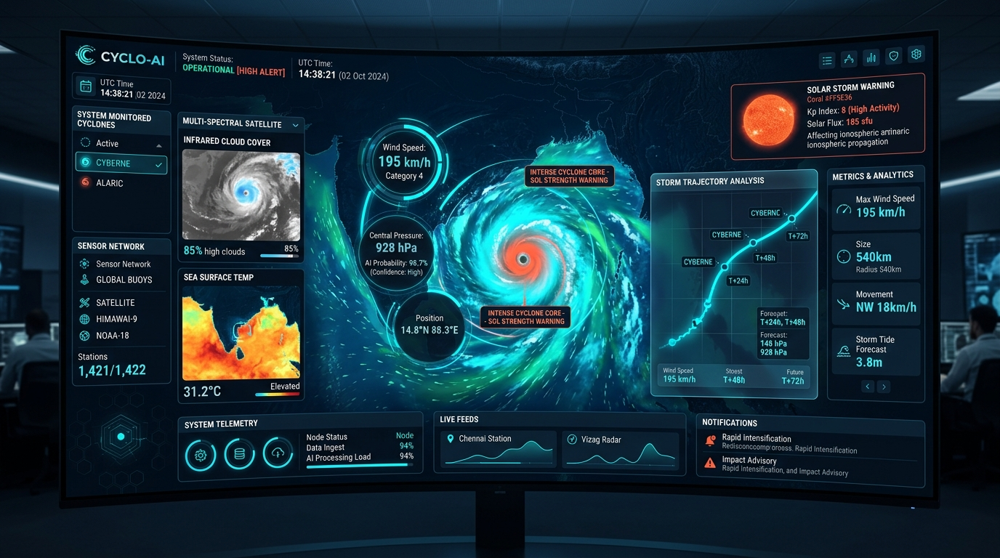
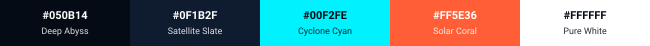
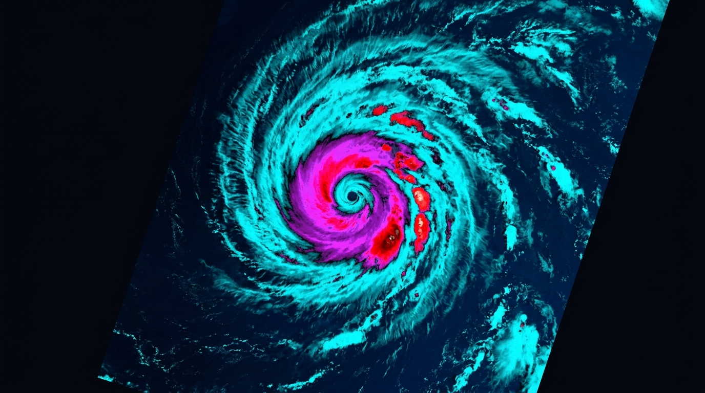
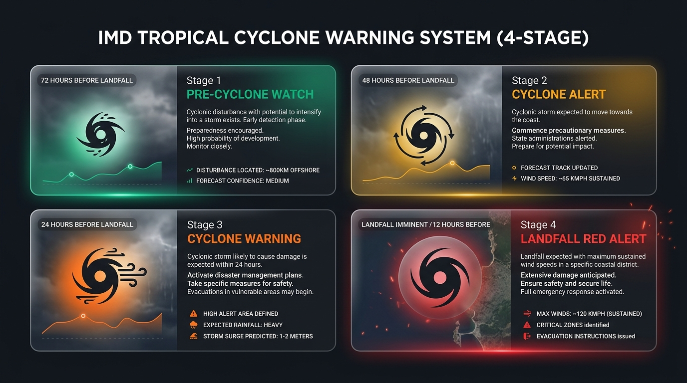
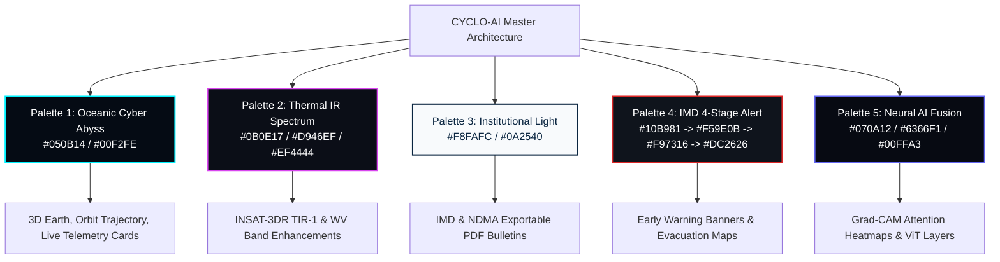

# 🎨 CYCLO-AI: Color Theme & Visual Identity Specification

**Project Topic:**  
> *"To develop an Artificial Intelligence (AI) / Machine Learning (ML) based system for identification, classification, and prediction of different tropical cyclone patterns using multi-source satellite data."*

---

## 📑 Table of Contents
1. [The Golden Ratio & Core Color Strategy](#1-the-golden-ratio--core-color-strategy)
2. [The Optimal Signature Color & Deep-Dive Rationale](#2-the-optimal-signature-color--deep-dive-rationale)
3. [Master Design Tokens (Oceanic Cyber Abyss)](#3-master-design-tokens-oceanic-cyber-abyss)
4. [5 Dedicated Project Color Palettes](#4-5-dedicated-project-color-palettes)
   - [🌌 Palette 1: Oceanic Cyber Abyss (Master Theme)](#-palette-1-oceanic-cyber-abyss-recommended-master-theme)
   - [🛰️ Palette 2: Multi-Spectral Thermal IR (Remote Sensing)](#️-palette-2-multi-spectral-thermal-ir-remote-sensing--pattern-studio)
   - [🏛️ Palette 3: Institutional Oceanic Precision (Light Mode)](#️-palette-3-institutional-oceanic-precision-official-light-mode)
   - [⚠️ Palette 4: WMO / IMD 4-Stage Alert Ecosystem](#️-palette-4-wmo--imd-4-stage-alert-ecosystem-early-warning-hub)
   - [🧠 Palette 5: Neural AI Fusion (Model Studio)](#-palette-5-neural-ai-fusion-explainable-ai--model-studio)
5. [Unified Hybrid Design Architecture](#5-unified-hybrid-design-architecture)
6. [Ready-to-Use CSS Variables Boilerplate](#6-ready-to-use-css-variables-boilerplate)

---

## 1. The Golden Ratio & Core Color Strategy

Meteorological and AI software requires a strict **60-30-10** color balance to ensure operational safety, high contrast over multi-spectral satellite channels, and an elite command-center aesthetic:

### 📊 Visual Balance Distribution


```
┌─────────────────────────────────────────────────────────────────────────────┐
│  CANVAS BASE (60%)       SIGNATURE / AI (30%)       CRITICAL ALERT (10%)    │
│  #050B14                 #00F2FE                    #FF5E36                 │
│  [Deep Abyss Navy]       [Electric Cyclone Cyan]    [Solar Storm Coral]     │
└─────────────────────────────────────────────────────────────────────────────┘
```

*  **60% Dominant Base (`#050B14`):** Minimizes eye fatigue during prolonged monitoring sessions; provides maximum contrast for satellite layers and 3D globe rendering.
*  **30% Structural / AI Telemetry (`#00F2FE`):** Drives visual hierarchy, model confidence indicators, trajectory lines, and active UI controls.
*   **10% High-Priority Alert (`#FF5E36` / `#EF4444`):** Strictly reserved for cyclone eye warnings, landfall timers, and high-risk alerts.

### 🖼️ Master Interface Illustration: Command Center in Action

*Figure 1: CYCLO-AI Command Center interface demonstrating the 60-30-10 color balance — Deep Abyss Navy (`#050B14`) canvas, glowing Electric Cyclone Cyan (`#00F2FE`) AI trajectory vectors, and Solar Coral (`#FF5E36`) emergency telemetry.*

---

## 2. The Optimal Signature Color & Deep-Dive Rationale

### The Winner: **Electric Cyclone Cyan ( `#00F2FE`) on Deep Abyss ( `#050B14`)**

### 5 Reasons Why This is the Absolute Best Choice:

1. **⚠️ Semantic Distinction from Emergency Warnings:**
   * In meteorological applications, **Red & Orange** are strictly reserved for *Severe Warnings, Rapid Intensification, and Landfall Alerts*, while **Green** indicates *Safe Conditions*.
   * If your primary brand color is red or orange, users cannot distinguish UI chrome from emergency warnings.
   * **Cyan is semantically neutral to danger.** When an orange/red alert badge appears, it immediately commands maximum visual urgency without clashing with the UI.

2. **🛰️ Maximum Optical Contrast on Multi-Source Satellite Imagery:**
   * The platform ingests **Visible (VIS)** (white clouds, dark sea), **Thermal Infrared (TIR-1)** (grayscale/rainbow), and **Water Vapor (WV)** (blue-gray fields).
   * Electric Cyan provides near-100% luminance contrast across all satellite layers, making the **AI Bounding Box (LLCC)** and **Forecast Trajectory Lines** crystal clear.

3. **🪐 Optimal WebGL Shaders & 3D Hero Bloom:**
   * In Three.js / WebGL, cyan wavelengths generate natural atmospheric Rayleigh scattering around the 3D Earth without heavy post-processing bloom shaders, preserving a smooth **60+ FPS**.

4. **🧠 Convergence of Three Scientific Domains:**
   * **Oceanography:** Warm ocean water and moisture feeds.
   * **Space & Satellites:** Orbital laser scanning and radar telemetry.
   * **Artificial Intelligence:** Universally recognized in high-tech UIs for neural network computation.

5. **🏆 Hackathon & Jury Psychology ("The 5-Second Rule"):**
   * Delivers an immediate **"ISRO / NASA Mission Control"** aesthetic, setting the application apart from generic student dashboards.

---

## 3. Master Design Tokens (Oceanic Cyber Abyss)

| Token Name | Swatch | Hex Code | RGB | Role & Exact UI Placement |
| :--- | :---: | :--- | :--- | :--- |
| `--bg-base` |  | `#050B14` | `rgb(5, 11, 20)` | Root application background, 3D WebGL deep space canvas |
| `--surface-glass` |  | `#0F1B2F` | `rgb(15, 27, 47)` | Translucent glassmorphic widgets (`backdrop-filter: blur(16px)`) |
| `--border-subtle` |  | `#1E3252` | `rgb(30, 50, 82)` | 1px card borders, table dividers, coordinate grid lines |
| `--accent-primary`|  | `#00F2FE` | `rgb(0, 242, 254)`| Cyclone trajectory line, 3D glowing rings, active buttons |
| `--accent-warning`|  | `#FF5E36` | `rgb(255, 94, 54)`| Cyclone Eye center marker, rapid intensification alerts |
| `--accent-success`|  | `#10E7A2` | `rgb(16, 231, 162)`| Model accuracy $>95\%$, normal sea conditions, safe routes |
| `--text-primary` |  | `#FFFFFF` | `rgb(255, 255, 255)`| Main headers, large metric values ($hPa, km/h$) |
| `--text-muted` |  | `#8E9EB5` | `rgb(142, 158, 181)`| Subtitles, timestamps, coordinate labels ($Lat/Lon$) |

---

## 4. 5 Dedicated Project Color Palettes

### 🌌 Palette 1: Oceanic Cyber Abyss (Recommended Master Theme)
*Best for: 3D interactive hero, live cyclone command dashboard, telemetry panels.*



| Role | Swatch | Color Name | Hex Code | Purpose |
| :--- | :---: | :--- | :--- | :--- |
| **Background** |  | Deep Abyss | `#050B14` | High-contrast space/ocean base |
| **Surface** |  | Satellite Slate | `#0F1B2F` | Glassmorphic floating HUD cards |
| **Primary Accent**|  | Cyclone Cyan | `#00F2FE` | Trajectory paths, active tabs, AI bounding boxes |
| **Warning Accent**|  | Solar Coral | `#FF5E36` | Eye detection center, severe cyclone badges |
| **Text Primary** |  | Pure White | `#FFFFFF` | Critical numerical telemetry readouts |

---

### 🛰️ Palette 2: Multi-Spectral Thermal IR (Remote Sensing & Pattern Studio)
*Best for: Satellite band viewer (TIR-1, TIR-2, WV), Dvorak BD-curve enhancements, cloud-top temperature legends.*


| Role | Swatch | Color Name | Hex Code | Purpose |
| :--- | :---: | :--- | :--- | :--- |
| **Space Void** |  | Deep Void | `#0B0E17` | Canvas background for raw satellite imagery |
| **Cloud Base** |  | Cold Slate | `#1C2237` | Inactive cloud and background ocean mask |
| **Low Convection** |  | Atmospheric Cyan | `#22D3EE` | Peripheral spiral rainbands |
| **Deep Convection**|  | Eyewall Magenta | `#D946EF` | Severe convective tops ($-70^\circ\text{C}$ to $-80^\circ\text{C}$) |
| **Thermal Peak** |  | Core Red | `#EF4444` | Brightness temperature gradient at the eye boundary |

### 🖼️ Multi-Spectral Thermal IR Imagery Visualization

*Figure 2: Multi-Spectral false-color cyclone analysis displaying Deep Void (`#0B0E17`), Atmospheric Cyan rainbands (`#22D3EE`), Eyewall Magenta (`#D946EF`), and Core Red convective zones (`#EF4444`).*

---

### 🏛️ Palette 3: Institutional Oceanic Precision (Official Light Mode)
*Best for: Official PDF disaster bulletins, daytime emergency operation rooms, IMD/NDMA administrative reports.*


| Role | Swatch | Color Name | Hex Code | Purpose |
| :--- | :---: | :--- | :--- | :--- |
| **Canvas** |  | Pristine Mist | `#F8FAFC` | Glare-free daylight background |
| **Card Surface** |  | Pure White | `#FFFFFF` | Clean report cards, modal dialogs, data tables |
| **Primary / Text** |  | Maritime Navy | `#0A2540` | Authoritative headings, high-contrast typography |
| **Action** |  | Pacific Azure | `#0284C7` | Interactive buttons, download triggers |
| **Alert Highlight**|  | Hazard Amber | `#EA580C` | Warning callout boxes in generated PDFs |

---

### ⚠️ Palette 4: WMO / IMD 4-Stage Alert Ecosystem (Early Warning Hub)
*Best for: 4-stage cyclone alert banners, district vulnerability heatmaps, evacuation prioritization.*


| Alert Stage | Swatch | Category Name | Hex Code | Operational Meaning |
| :--- | :---: | :--- | :--- | :--- |
| **Base** |  | Graphite Charcoal | `#0F141C` | Neutral dark background for maximum alert visibility |
| **Stage 1 (Advisory)**|  | Pre-Cyclone Watch | `#10B981` | Depression formed; 72 hours prior to threat |
| **Stage 2 (Alert)** |  | Cyclone Alert | `#F59E0B` | Cyclonic Storm; 48 hours prior to landfall |
| **Stage 3 (Warning)** |  | Cyclone Warning | `#F97316` | Severe Cyclone; 24 hours prior to landfall |
| **Stage 4 (Extreme)**|  | Landfall Red Alert | `#DC2626` | Super Cyclone / Landfall imminent ($<12\text{ hours}$) |

### 🖼️ IMD 4-Stage Early Warning System UI Illustration

*Figure 3: Official 4-stage early warning system cards — Stage 1 Watch (`#10B981`), Stage 2 Alert (`#F59E0B`), Stage 3 Warning (`#F97316`), and Stage 4 Landfall Red Alert (`#DC2626`).*

---

### 🧠 Palette 5: Neural AI Fusion (Explainable AI & Model Studio)
*Best for: Grad-CAM attention overlays, Vision Transformer feature tokens, loss convergence graphs.*


| Role | Swatch | Color Name | Hex Code | Purpose |
| :--- | :---: | :--- | :--- | :--- |
| **Quantum Base** |  | Deep Neural Void | `#070A12` | Model architecture inspection canvas |
| **Neural Surface**|  | Layer Surface | `#13192B` | Feature map cards, model weight containers |
| **Neural Indigo** |  | Attention Indigo | `#6366F1` | Transformer self-attention lines, latent vectors |
| **Precision Mint**|  | AI Detection Mint | `#00FFA3` | Detected eye bounding boxes, confidence $>95\%$ |
| **Anomaly Rose** |  | Track Divergence | `#FB7185` | Prediction error variance, Rapid Intensification flags |

---

## 5. Unified Hybrid Design Architecture

The five palettes integrate seamlessly across the platform:

```
┌───────────────────────────────────────────────────────────────────────────────┐
│                           UNIFIED DESIGN SYSTEM                              │
├────────────────────────────────┬──────────────────────────────────────────────┤
│ 1. Master Web App & 3D Hero    │ Palette 1: Oceanic Cyber Abyss (#050B14 Base)│
│ 2. Satellite Analysis Studio   │ Palette 2: Thermal IR Multi-Spectral (#D946EF)│
│ 3. PDF Bulletins & Reports     │ Palette 3: Institutional Precision (#F8FAFC) │
│ 4. Disaster Alert Banners      │ Palette 4: IMD 4-Stage Alerts (#10B981-#DC2626)│
│ 5. AI Explainability (Grad-CAM)│ Palette 5: Neural Fusion (#6366F1 & #00FFA3) │
└────────────────────────────────┴──────────────────────────────────────────────┘
```



---

## 6. Ready-to-Use CSS Variables Boilerplate

```css
:root {
  /* Core Canvas & Surfaces (Palette 1) */
  --bg-base: #050B14;               /* Deep Abyss Navy */
  --bg-surface: #0F1B2F;            /* Satellite Slate Glassmorphic HUD */
  --bg-surface-elevated: #16253D;   /* Elevated Card Surface */
  --border-subtle: #1E3252;         /* 1px Card & Grid Divider */
  --border-glow: rgba(0, 242, 254, 0.35); /* Electric Cyan Glow Ring */

  /* Primary Brand & AI Telemetry */
  --color-ai-cyan: #00F2FE;          /* Electric Cyclone Cyan Trajectory */
  --color-ai-cyan-glow: rgba(0, 242, 254, 0.4);
  --color-ai-mint: #10E7A2;          /* Safe / High Confidence Metric */
  --color-neural-indigo: #6366F1;    /* Transformer Attention Vector */

  /* IMD / WMO Warning Tiers (Palette 4) */
  --alert-stage-1-watch: #10B981;    /* Pre-Cyclone Watch (72h) */
  --alert-stage-2-alert: #F59E0B;    /* Cyclone Alert (48h) */
  --alert-stage-3-warning: #F97316;  /* Cyclone Warning (24h) */
  --alert-stage-4-landfall: #DC2626; /* Landfall Red Alert (<12h) */

  /* Thermal Infrared Spectrum (Palette 2) */
  --ir-cloud-low: #22D3EE;           /* Atmospheric Cyan Rainbands */
  --ir-cloud-deep: #D946EF;          /* Eyewall Convection Magenta */
  --ir-cloud-extreme: #EF4444;       /* Core Temperature Red Peak */

  /* Typography */
  --text-primary: #FFFFFF;          /* Pure White Critical Readouts */
  --text-secondary: #CBD5E1;        /* Slate Light Text */
  --text-muted: #8E9EB5;            /* Coordinate & Telemetry Labels */
}
```

---
*Maintained as the official color reference for CYCLO-AI (SIH 2026).*
