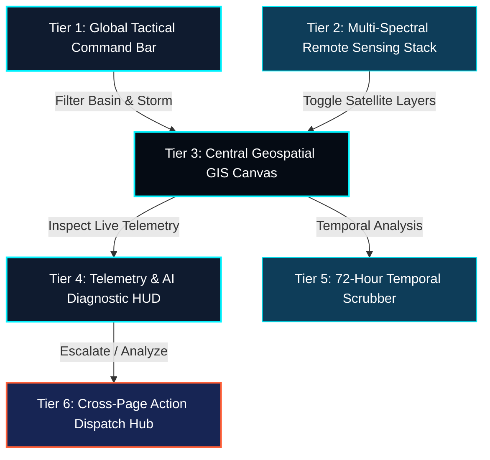

# 🛰️ CYCLO-AI: Page 3 — Live Cyclone Monitoring & Geospatial Command Dashboard (`/dashboard`)

**Project Topic:**  
> *"To develop an Artificial Intelligence (AI) / Machine Learning (ML) based system for identification, classification, and prediction of different tropical cyclone patterns using multi-source satellite data."*

**Document Scope:** Complete Architectural, Technical, Geospatial, Functional Specification, Cognitive Hierarchy Framework, and Interactive Button Matrix of **Page 3: Live Cyclone Monitoring & Geospatial Command Dashboard**.

---

## 🏛️ 1. The 5-Tier Cognitive Hierarchy Framework

To provide an intuitive workflow and a high-tech "command room" aesthetic, Page 3 is structured around a **5-Tier Cognitive Hierarchy Framework**. This layout guides the operator's eye from high-level global context down to granular storm physics and rapid dispatch actions.



---

## 📐 2. Viewport Layout & Visual Architecture

The dashboard uses a full-viewport tactical layout adhering to the **Golden Ratio 60-30-10** color rule:
* **60% Void Canvas (`#050B14`):** High-contrast base for satellite imagery and ocean basins.
* **30% Glassmorphic HUDs (`#0F1B2F` / `#0E3D59`):** Translucent panels with `backdrop-filter: blur(16px)` and subtle cyan borders (`rgba(0, 242, 254, 0.2)`).
* **10% High-Alert Accents (`#00F2FE` Electric Cyan, `#FF5E36` Hazard Coral, `#FFB300` Amber):** Reserved for telemetry gauges, active storm eyes, and emergency indicators.

```
┌────────────────────────────────────────────────────────────────────────────────────────────────────────────────────────┐
│ [CYCLO-AI LOGO]  [STORM: MOCHA (VSCS) ▼]  [BASIN: BAY OF BENGAL ▼]  [AUTO-SYNC: 15m ⚡]  [UTC 09:30 | IST 15:00] [🧑‍🔬 SCIENTIST] │
├──────────────────────────────────────────────────────────────────────────────────────────┬─────────────────────────────┤
│ ┌───────────────────────────┐                                                            │ 🛰️ STORM TELEMETRY HUD      │
│ │ 🗺️ MULTI-SPECTRAL STACK   │                                                            │ ┌─────────────────────────┐ │
│ │ [●] TIR-1 (Thermal 10.8µm)│                 (North Indian Ocean Basin)                 │ │ VSCS — CATEGORY 3       │ │
│ │ [ ] VIS (0.65µm High-Res) │                               *                            │ │ IMD Classification      │ │
│ │ [ ] WV (6.8µm Moisture)   │                         *           *                      │ └─────────────────────────┘ │
│ │ [✓] Scatterometer Winds   │                    *     (Cyclone Eye)   *                 │ Automated Dvorak: T-4.5/CI4.5│
│ │ [✓] SST Ocean Thermal Fuel│                   *   [942 hPa / 185 km/h] *               │ LLCC:         16.2°N, 88.4°E│
│ │ ───────────────────────── │                  *     R_max (35 km)        *              │                             │
│ │ 🎚️ Layer Opacity [ 85%  ] │                       *               *                    │ Max Sustained Wind Speed:   │
│ └───────────────────────────┘                           *       *                        │ [ 185 km/h  (100 knots)   ] │
│ ┌───────────────────────────┐                               *                            │ Central Barometric Pressure:│
│ │ 🛠️ MAP TOOLBOX            │                                                            │ [ 942 hPa (ΔP: -18hPa/6h) ] │
│ │ [⛶ Fullscreen] [🔍+] [🔍-] │           ────── Observed Track Gradient ──────>          │ Translation Vector:         │
│ │ [📏 Orthodromic Ruler]    │                                                            │ [ NNW (335°) at 14 km/h   ] │
│ │ [📍 16.2415°N, 88.4120°E  ]│                                                            │ Rapid Intensification (RI): │
│ └───────────────────────────┘                                                            │ [ 88% High Probability ⚠️ ] │
│                                                                                          ├─────────────────────────────┤
│                                                                                          │ ⚡ ACTION DISPATCH HUB      │
│                                                                                          │ [ 🔬 Deep Analyze in AI ]   │
│                                                                                          │ [ 📈 Forecast & Trajectory] │
│                                                                                          │ [ 📥 Export GeoJSON / KML ] │
│                                                                                          │ [ ⚠️ Broadcast Alert (NDMA)]│
├──────────────────────────────────────────────────────────────────────────────────────────┴─────────────────────────────┤
│ ⏱️ 72-HOUR SYNCHRONIZED TEMPORAL SCRUBBER: [⏮️ -1h] [▶️ Play] [⏸️ Pause] [⏭️ +1h] [Speed: 1x ▼] [Live Frame: INSAT-3DR]    │
│  -72h ─────────────── -48h ─────────────── -24h ─────────────── -12h ─────────────── -0h (LIVE SATELLITE FEED) ─────── │
└────────────────────────────────────────────────────────────────────────────────────────────────────────────────────────┘
```

---

## 🔍 3. Component Breakdown & Feature Rationale ("Why Each Feature is Kept")

### Tier 1: Global Tactical Command Bar (Top Horizon)

| Feature / UI Component | Technical Functionality | Why It Is Kept in the Dashboard |
| :--- | :--- | :--- |
| **Active Storm Selector Dropdown** | Allows instantaneous switching between tracked depressions, deep depressions, and super cyclones, or selecting *"Aggregate Multi-Storm View"*. | In multi-cyclone scenarios (e.g., simultaneous systems in the Arabian Sea and Bay of Bengal), operators need single-click switching without page reloads. |
| **Ocean Basin Geographic Filter** | Segmented selector: `Bay of Bengal`, `Arabian Sea`, `North Indian Ocean`, `Global (JTWC/NOAA)`. | Focuses GIS bounds and data pipelines on the specific Area of Responsibility (AoR) for regional cyclone warning centers (RSMC New Delhi). |
| **Auto-Sync Interval Toggle** | Configurable polling worker (`Off`, `5m`, `15m`, `30m`). Includes a pulsating green telemetry beacon during ingestion. | Satellite scans (such as INSAT-3DR Rapid Scan Mode) update every 15 minutes; synchronizing UI refresh ensures zero lag without overwhelming API limits. |
| **Dual Chronometer (UTC + IST)** | Monospace digital readout rendering both Coordinated Universal Time (UTC) and Indian Standard Time (IST). | Satellite telemetry and numerical weather prediction (NWP) models operate strictly in UTC, while ground disaster teams operate in IST. |
| **Role & Security Clearance Badge** | Displays authenticated user tier (`🧑‍🔬 IMD Lead Scientist`, `🛡️ NDMA Commander`, `👤 Public Observer`). | Dynamic Role-Based Access Control (RBAC) ensures restricted actions (like emergency broadcasts) are only actionable by authorized personnel. |

---

### Tier 2: Multi-Spectral Remote Sensing Stack (Left Floating Panel)

| Remote Sensing Channel / Layer | Sensor / Resolution Source | Meteorological Purpose & Why It Is Kept |
| :--- | :--- | :--- |
| **Thermal Infrared (TIR-1 — 10.8 µm)** | INSAT-3D/3DR TIR-1 ($4\text{ km}$ resolution) with Dvorak BD Color Ramp. | **Primary Intensity Estimator:** Detects cloud-top temperatures down to $-80^\circ\text{C}$. The temperature contrast between the warm eye and cold eyewall determines Dvorak T-numbers. |
| **Visible Imagery (VIS — 0.65 µm)** | INSAT-3DR / Oceansat-3 ($1\text{ km}$ high-res daytime). | **Structural Analysis:** Highlights convective feeder bands, eye definition, and low-level center exposure during daylight hours. |
| **Water Vapor Channel (WV — 6.8 µm)** | INSAT-3D Sounder / Imager ($8\text{ km}$). | **Tropospheric Dynamics:** Maps upper-level wind shear, dry-air intrusions, and outflow jet streams that either fuel or tear apart the cyclone vortex. |
| **Scatterometer Wind Vectors** | Oceansat-3 (OSCAT) / MetOp ASCAT ($12.5\text{ km}$ vector grid). | **Surface Ground Truth:** Overcomes cloud obstruction by using microwave backscatter to measure true ocean-surface wind speeds ($knots$) and circulation centers. |
| **Sea Surface Temperature (SST) Heatmap** | GHRSST Multi-Scale Fusion ($0.05^\circ$ grid). | **Thermodynamic Fuel Gauge:** Identifies ocean thermal heat energy; water temperatures $>26.5^\circ\text{C}$ indicate potential for Rapid Intensification (RI). |
| **Layer Opacity Slider (`0% - 100%`)** | GPU Fragment Shader uniform alpha blend. | Allows meteorologists to blend raw infrared imagery over high-resolution bathymetry and vector wind arrows simultaneously. |

---

### Tier 3: Interactive Geospatial GIS Map Canvas (Center Viewport)

* **Dynamic Low-Level Circulation Center (LLCC) Eye Pin:** Animated pulsing double-ring marker anchored to the exact coordinates calculated by AI centroiding. Clicking reveals instant eye metadata.
* **Color-Coded Historical Track Polyline:** Solid line showing storm trajectory over past 72 hours, color-coded by IMD severity scale:
  * 🟡 *Depression / Deep Depression ($<62\text{ km/h}$)*
  * 🟠 *Cyclonic Storm / Severe Cyclonic Storm ($63 - 117\text{ km/h}$)*
  * 🔴 *Very Severe / Extremely Severe Cyclonic Storm ($118 - 221\text{ km/h}$)*
  * 🟣 *Super Cyclonic Storm ($\ge 222\text{ km/h}$)*
* **Radius of Maximum Winds ($R_{max}$ Buffer):** Concentric circular overlay (e.g., $35\text{ km}$ radius) displaying the exact spatial ring where maximum kinetic energy is concentrated.
* **Asymmetric Quad Wind Radii (34 kt, 50 kt, 64 kt):** True directional polygon projections representing gale, storm, and hurricane force winds across the NE, SE, SW, and NW quadrants.
* **Tactical GIS Toolbox:**
  * **Orthodromic Distance Ruler:** Calculates real-time distance from cyclone eye to ports, coastlines, and major cities (e.g., *"184 km to Paradip Port | Est. Closest Approach: 8.5h"*).
  * **Lat/Lon Cursor Tracker:** Displays live coordinate readouts down to 4 decimal places.
  * **EOC Fullscreen Mode (`F11`):** Clears browser UI to format the screen for disaster management video walls.

---

### Tier 4: Real-Time Telemetry & AI Diagnostic HUD (Right Panel)

| Metric Card / Widget | Live Telemetry Data | Scientific Function & Operational Value |
| :--- | :--- | :--- |
| **IMD Category Badge** | *VERY SEVERE CYCLONIC STORM (Category 3)* | Instant identification of threat level for emergency protocols. |
| **Automated AI Dvorak Index** | `T4.5 / CI 4.5` (Confidence: $96.8\%$) | Automates subjective manual Dvorak cloud pattern analysis via deep convolutional neural networks. |
| **Peak Sustained Wind Gauge** | Circular SVG Gauge: `185 km/h` (`100 knots`) | Real-time maximum sustained 3-minute average wind speed with gust estimation ($210\text{ km/h}$). |
| **Central Barometric Pressure** | Digital Barometer: `942 hPa` | Informs pressure deficit ($\Delta P = -18\text{ hPa / 6h}$); rapid pressure drop signals rapid intensification. |
| **Storm Translation Vector** | `NNW (335°) at 14 km/h` | Tracks speed and direction of physical storm movement toward coastal landfall. |
| **Rapid Intensification (RI) Probability** | `88% — HIGH RISK OF RI (+30 kt / 24h)` | Machine learning classifier evaluating wind shear vs. SST to predict sudden storm strengthening. |

---

### Tier 5: 72-Hour Synchronized Temporal Scrubber (Bottom Bar)

* **Purpose:** Allows meteorologists to inspect past satellite imagery frame-by-frame, observe the formation of the cyclone eye, and check for dry air entrainment or eyewall replacement cycles (EWRC).
* **Controls:** Draggable slider thumb, step backward/forward buttons (`⏮️`, `⏭️`), loop-playback toggle (`▶️`), and playback speed multiplier ($1\times, 2\times, 4\times$).

---

### Tier 6: Cross-Page Action Dispatch Hub (Bottom Right)

1. **"Deep Analyze in AI Studio" (Primary CTA):** Packages the current satellite frame, storm ROI bounding box, and infrared band data, transferring them directly into **Page 4 (`/satellite-analyzer`)** for Grad-CAM explainability and automated Dvorak decomposition.
2. **"Trajectory & Forecast Engine" (Secondary CTA):** Transfers current coordinates and translation vectors into **Page 5 (`/forecast`)** to run physics-informed neural network (PINN) cone-of-uncertainty simulations.
3. **"Export GeoJSON / KML":** Generates an open GIS file containing past track coordinates, current wind radii polygons, and storm attributes for external GIS suites (QGIS, ArcGIS, Google Earth).
4. **"Broadcast Alert (NDMA/SDMA)" (Critical CTA):** Instant handoff to **Page 6 (`/alerts`)** to dispatch Common Alerting Protocol (CAP) SMS/radio emergency alerts to threatened coastal districts.

---

## 🎛️ 4. Exhaustive Matrix of Interactive Buttons & Controls

| # | Control Name | UI Placement | Control Type | Visual State / Token | Execution Action / Output | Destination / System Target |
| :-: | :--- | :--- | :--- | :--- | :--- | :--- |
| **1** | **Storm Selector** | Top Bar (Left) | Select Menu | `#0F1B2F` + Cyan Border | Switches active storm context | Re-queries `/api/storm/telemetry` |
| **2** | **Basin Filter** | Top Bar (Left) | Segmented Tabs | Active: Cyan Glow (`#00F2FE`) | Filters map viewport by ocean basin | Pan/Zoom GIS camera |
| **3** | **Auto-Sync Toggle** | Top Bar (Center)| Radio Buttons | Pulse Dot Animation | Changes background polling rate | Data Ingestion Service Worker |
| **4** | **Manual Refresh** | Top Bar (Center)| Icon Button | Cyan sync icon (Spins on click) | Forces immediate satellite re-fetch | API re-query (`/api/satellite/live`) |
| **5** | **Profile / RBAC** | Top Bar (Right) | User Avatar Pill | Slate glass with role pill | Opens user permissions & settings | `/settings` modal |
| **6** | **TIR-1 Layer Toggle** | Layer Switcher | Checkbox Toggle | Cyan checkbox (`#00F2FE`) | Toggles 10.8 µm Thermal IR raster | Leaflet WMS Layer |
| **7** | **VIS Layer Toggle** | Layer Switcher | Checkbox Toggle | Cyan checkbox (`#00F2FE`) | Toggles High-Res Visible imagery | Leaflet WMS Layer |
| **8** | **WV Layer Toggle** | Layer Switcher | Checkbox Toggle | Cyan checkbox (`#00F2FE`) | Toggles 6.8 µm Water Vapor layer | Leaflet WMS Layer |
| **9** | **Scatterometer Winds**| Layer Switcher | Checkbox Toggle | Cyan checkbox (`#00F2FE`) | Renders surface wind vector field | WebGL Particle Wind Canvas |
| **10**| **SST Heatmap Toggle** | Layer Switcher | Checkbox Toggle | Cyan checkbox (`#00F2FE`) | Renders Sea Surface Temp heatmap | Raster Heatmap Layer |
| **11**| **Layer Opacity Slider**| Layer Switcher| Range Slider | Glowing Cyan Thumb | Modifies active layer transparency | WebGL Shader Alpha Uniform |
| **12**| **Zoom In (`+`)** | Map Tools (Left) | Icon Button | Square Glass Button | Zooms in map viewport by 1 step | Map Canvas Zoom (`+1`) |
| **13**| **Zoom Out (`-`)**| Map Tools (Left) | Icon Button | Square Glass Button | Zooms out map viewport by 1 step| Map Canvas Zoom (`-1`) |
| **14**| **Recenter / Home**| Map Tools (Left) | Icon Button | Crosshair Icon (Hover Glow) | Smooth-pans map back to storm eye | Animated GIS Camera Pan |
| **15**| **Distance Ruler** | Map Tools (Left) | Icon Toggle | Active: Pulsing Cyan Ruler | Enables geodetic click-to-measure | Distance Polyline + Tooltip |
| **16**| **Fullscreen Toggle** | Map Tools (Left) | Icon Button | Expand / Shrink SVG Icon | Toggles browser fullscreen | HTML5 Fullscreen API |
| **17**| **Cyclone Eye Hotspot** | Map Canvas | Interactive SVG | Double-ring pulsating coral marker | Opens instant storm telemetry popover | Map Popover Card |
| **18**| **Timeline Play/Pause** | Bottom Bar | Icon Button | `▶️` Play $\leftrightarrow$ `⏸️` Pause | Starts/stops sequential frame loop | WebGL Frame Loop Animation |
| **19**| **Step -1h Frame** | Bottom Bar | Icon Button | Slate Glass `⏮️` | Steps back 1 satellite frame | Historical Time Cursor |
| **20**| **Step +1h Frame** | Bottom Bar | Icon Button | Slate Glass `⏭️` | Steps forward 1 satellite frame | Historical Time Cursor |
| **21**| **Playback Speed** | Bottom Bar | Dropdown Pill | Monospace (`1x, 2x, 4x`) | Modifies frame animation delay | Frame Rate Controller |
| **22**| **Timeline Scrubber**| Bottom Bar | Draggable Range | Cyan Thumb + Timestamp Tooltip | Jumps to specific time in 72h window | Ingests Cached Tile Frame |
| **23**| **Deep Analyze in AI** | Telemetry HUD | Primary Button | Glowing Cyan Gradient | Transfers storm ROI to AI Analyzer | `/satellite-analyzer?storm=mocha` |
| **24**| **Forecast Trajectory**| Telemetry HUD | Secondary Button | Dark Slate + Cyan Border | Passes live vector to PINN model | `/forecast?storm=mocha` |
| **25**| **Export GeoJSON** | Telemetry HUD | Secondary Button | Outlined Download Button | Generates storm track GeoJSON/KML | Client File Download |
| **26**| **Broadcast Alert** | Telemetry HUD | Critical Button | Hazard Coral `#FF5E36` + Warning Pulse| Opens Emergency Broadcast modal | `/alerts?storm=mocha` |

---

## 🔬 5. Domain-Specific Meteorological Value Proposition

By structuring Page 3 around this tactical architecture, CYCLO-AI resolves key operational challenges in cyclone warning:

1. **Eliminates Manual Ingestion Delays:** Fuses INSAT-3DR, Oceansat-3, and GHRSST feeds into a unified WebGL coordinate space, saving 15–30 minutes per forecast cycle.
2. **Standardizes Objective Dvorak Intensity:** Replaces manual visual estimation with automated deep-learning T-number and CI-number calculations.
3. **Improves Situational Awareness for EOCs:** Combines distance-to-coast measurements, asymmetric wind radii, and rapid intensification probability into a single screen, accelerating decision-making for district collectors and disaster response forces.
