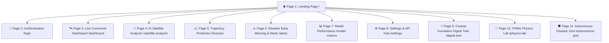

# 🌐 CYCLO-AI: Page 1 — Landing Page (`/`) In-Depth Specification

**Project Topic:**  
> *"To develop an Artificial Intelligence (AI) / Machine Learning (ML) based system for identification, classification, and prediction of different tropical cyclone patterns using multi-source satellite data."*

**Document Scope:** Complete Architectural, Technical, UI/UX, and Functional Breakdown of **Page 1: Landing Page (`/`)**.

---

## 🗺️ 1. Navigation Flow & System Context

The Landing Page (`/`) serves as the central gateway and public-facing portal for the entire CYCLO-AI ecosystem. Evaluators, scientific researchers, disaster management officials, and the public land here first.



---

## 📐 2. Visual Layout & Wireframe Architecture

```
┌──────────────────────────────────────────────────────────────────────────────────────────────────┐
│ [LOGO: CYCLO-AI]   [🔴 ACTIVE: CYCLONE MOCHA]   Home  Dashboard  AI Studio  Forecasts  Alerts  Docs   [🌓] [LAUNCH DASHBOARD] │
├──────────────────────────────────────────────────────────────────────────────────────────────────┤
│                                                                                                  │
│  ┌──────────────────────────────┐        ┌────────────────────────────────────────────────────┐  │
│  │ 🛰️ SATELLITE FEED: ACTIVE    │        │                                                    │  │
│  │ Sensor: INSAT-3DR TIR-1      │        │                3D Photorealistic Earth             │  │
│  │ Band: 10.8 µm | Latency: 12s │        │                                                    │  │
│  └──────────────────────────────┘        │            🌀 Cyclone Vortex (GLSL Noise)          │  │
│                                          │                 ─── Wind Streamlines ───           │  │
│     AI-POWERED INTELLIGENCE FOR          │                                                    │  │
│     TROPICAL CYCLONE IDENTIFICATION      │         [🛰️ INSAT-3D Scanning Laser Cone]          │  │
│     & INTENSITY PREDICTION               │                                                    │  │
│                                          │      [Interactive Eye Hotspot: 942 hPa / T-5.5]    │  │
│     [🚀 Launch Dashboard] [🔬 AI Studio] │                                                    │  │
│                                          └────────────────────────────────────────────────────┘  │
├──────────────────────────────────────────────────────────────────────────────────────────────────┤
│ 🔴 LIVE BASIN TICKER:  [Cyclones Active: 02] | [Cyclone MOCHA - BoB - Cat 3 - 185 km/h - 942 hPa] | [Deep Depression ARB-01]  │
├──────────────────────────────────────────────────────────────────────────────────────────────────┤
│ 🛠️ CORE CAPABILITIES & AI BENCHMARKS:                                                            │
│ ┌──────────────────────┐ ┌──────────────────────┐ ┌──────────────────────┐ ┌───────────────────┐ │
│ │ 🛰️ Multi-Source Fusion│ │ 🧠 Deep Pattern AI   │ │ 📈 Physics Trajectory│ │ 🔍 Explainable XAI│ │
│ │ INSAT-3D, Oceansat,  │ │ Automated Dvorak &   │ │ PINNs + Navier-Stokes│ │ Grad-CAM Eyewall  │ │
│ │ Scatterometer Winds  │ │ Eye LLCC Detection   │ │ 120h Track & Intensity│ │ Attention Maps   │ │
│ └──────────────────────┘ └──────────────────────┘ └──────────────────────┘ └───────────────────┘ │
├──────────────────────────────────────────────────────────────────────────────────────────────────┤
│ 🏛️ INSTITUTIONAL CREDITS: IMD | ISRO / MOSDAC | NOAA | WMO | Emergency Helplines (NDMA: 1078)  │
└──────────────────────────────────────────────────────────────────────────────────────────────────┘
```

---

## 🧩 3. Section-by-Section Feature Specifications

### Section A: Global Navigation Header
* **Component ID:** `#global-nav`
* **Styling:** Floating glassmorphic bar with `backdrop-filter: blur(12px)`, `background: rgba(5, 11, 20, 0.85)`, and a subtle bottom border `1px solid rgba(0, 242, 254, 0.2)`.
* **Sub-components:**
  1. **Brand Logo:** Vector cyclone symbol with animated glow + typography `"CYCLO-AI"` in Electric Cyan (`#00F2FE`).
  2. **Live Warning Status Pill:**
     * State 1: `🟢 Normal Basin Status` (`background: rgba(0, 230, 118, 0.1)`, `border: 1px solid #00E676`).
     * State 2: `🔴 Active Warning: Cyclone Mocha` (`background: rgba(255, 94, 54, 0.15)`, `border: 1px solid #FF5E36`, flashing pulse animation).
  3. **Nav Links:** High-contrast links with hover underline transitions (`Home`, `Live Dashboard`, `AI Analyzer`, `Forecasts`, `Alerts`, `Docs`).
  4. **Theme Switcher:** Single-click toggle between Dark Tactical Mode (`#050B14`) and Scientific High-Contrast Mode.
  5. **Header CTA Button:** `"Launch Dashboard"` with glowing cyan gradient border.

---

### Section B: 3D Interactive WebGL Hero Canvas
* **Component ID:** `#hero-3d-canvas`
* **Engine:** Three.js / WebGL with custom GLSL Vertex & Fragment Shaders.
* **Target FPS:** 60+ FPS on standard hardware.
* **Visual Elements:**
  * **3D Earth Globe:** High-resolution normal & specular bump map centered over the Bay of Bengal & Arabian Sea ($5^\circ\text{N} - 25^\circ\text{N}, 60^\circ\text{E} - 95^\circ\text{E}$).
  * **Procedural Cyclone Vortex:**
    * Mathematical logarithmic spiral: $r = a \cdot e^{b\theta}$ with Simplex/Curl noise displacing cloud particles.
    * Distinct central **Eye Wall** and outer spiral rainbands with height displacement.
  * **GPU-Instanced Wind Streamlines:**
    * 25,000+ GPU particles swirling cyclonically (counter-clockwise) at sea level and anticyclonically (clockwise) in the upper-troposphere exhaust canopy.
  * **Orbital Satellite Model & Scanning Cone:**
    * 3D satellite mesh in geostationary orbit (~36,000 km altitude scaled).
    * Dynamic pulsing laser cone projecting downward onto the storm's Low-Level Circulation Center (LLCC) to represent live data ingestion.
* **User Interactions:**
  * **Inertial 360° Orbit:** Smooth click-and-drag (mouse) or single-finger swipe (touch) to rotate the Earth from any viewpoint.
  * **Parallax Depth:** Sub-pixel camera shifts responding to cursor position.
  * **Clickable Eye Hotspots:** Glowing pins on the eye and outer band that pop open real-time telemetry modals.
  * **Bounded Zoom:** Mouse wheel / pinch-to-zoom bounded between $1.2\times$ and $3.5\times$ zoom to preserve framing.
* **Glassmorphic HUD Overlays:**
  * **Top-Left Feed Badge:** Real-time satellite stream status (`INSAT-3DR TIR-1 10.8µm`).
  * **Bottom-Left Telemetry Box:** Central Pressure ($942\text{ hPa}$), Max Wind ($185\text{ km/h}$), Category (VSCS Cat-3).
  * **Top-Right Performance Monitor:** Real-time FPS, GPU Memory allocation, and Draw Call count.
  * **Bottom-Right Shader HUD:** Active shader passes (`Rayleigh Atmosphere`, `Curl Noise Particle Instancing`).

---

### Section C: Real-Time Live Storm Ticker & Alert Bar
* **Component ID:** `#live-storm-ticker`
* **Styling:** Full-width dark slate strip with subtle scanline overlay and marquee-style live update loop.
* **Telemetry Data Points:**
  * **Active Cyclones Counter:** Total active disturbances in North Indian Ocean (BoB/AS) and Western Pacific.
  * **Storm Metadata Chips:**
    * Storm Name (e.g., *Cyclone MOCHA*)
    * IMD Classification Badge (*Very Severe Cyclonic Storm*)
    * Current Coordinates ($16.2^\circ\text{N}, 88.4^\circ\text{E}$)
    * Peak Sustained Wind Speed ($185\text{ km/h} \mid 100\text{ kts}$)
    * Minimum Central Pressure ($942\text{ hPa}$)
    * Heading & Forward Speed (*NNE at 16 km/h*)

---

### Section D: Core Technology & Capability Cards
* **Component ID:** `#core-features-grid`
* **Styling:** 4-column responsive grid with glassmorphism cards (`#0F1B2F`), gradient borders, and hover 3D tilt micro-animations.

| Card # | Feature Title | Technical Description & Scope | Associated Module |
| :--- | :--- | :--- | :--- |
| **01** | **Multi-Source Satellite Fusion** | Ingests and harmonizes INSAT-3D/3DR (TIR-1, TIR-2, MIR, VIS, WV), Oceansat-3, Scatterometer surface wind vectors, and NOAA GOES datasets. | `/satellite-analyzer` |
| **02** | **Deep Learning Pattern Studio** | Automated Dvorak technique (ADT), automated Eye/LLCC centroid detection, and classification across Curved Band, Eye, CDO, and Shear patterns. | `/satellite-analyzer` |
| **03** | **Physics-Informed Forecasting** | PINNs (Physics-Informed Neural Networks) enforcing Navier-Stokes conservation laws for $120\text{h}$ trajectory and rapid intensification (RI) predictions. | `/forecast` & `/physics-lab` |
| **04** | **Explainable AI (XAI / Grad-CAM)** | Real-time gradient-weighted class activation mapping (Grad-CAM) and attention heatmaps showing exact cloud features driving AI decisions. | `/satellite-analyzer` |

---

### Section E: Institutional Credits & Emergency Footer
* **Component ID:** `#global-footer`
* **Attribution & Partnerships:**
  * India Meteorological Department (IMD)
  * ISRO / MOSDAC (Meteorological and Oceanographic Satellite Data Archival Centre)
  * NOAA (National Oceanic and Atmospheric Administration)
  * World Meteorological Organization (WMO)
* **Emergency Broadcast / Hotline Links:**
  * NDMA National Disaster Helpline (`1078`)
  * State Emergency Operations Centre (SEOC) quick-dial
* **Direct Links:** REST API documentation (`/api/v1/docs`), System status page, and SIH 2026 Submission Repository.

---

## 🎛️ 4. Exhaustive Matrix of Buttons & Interactive Controls on Page 1

| # | UI Element / Button Name | Location / Section | Element Type | Normal / Hover Styling | On-Click / Interaction Action | Target Destination |
| :-: | :--- | :--- | :--- | :--- | :--- | :--- |
| **1** | **"CYCLO-AI" Logo** | Header (Left) | Interactive Brand Link | Cyan text `#00F2FE` + Glow | Smooth-scrolls to top of page | `/` |
| **2** | **Live Alert Pill** | Header (Center) | Warning Status Badge | Flashing Hazard Coral `#FF5E36` | Opens Active Warning & Evacuation Hub | `/alerts` |
| **3** | **"Home"** | Header Nav | Nav Link | Slate `#94A3B8` $\rightarrow$ Cyan `#00F2FE` | Stays / reloads Landing Page | `/` |
| **4** | **"Live Dashboard"** | Header Nav | Nav Link | Slate `#94A3B8` $\rightarrow$ Cyan `#00F2FE` | Opens real-time GIS Command Center | `/dashboard` |
| **5** | **"AI Analyzer"** | Header Nav | Nav Link | Slate `#94A3B8` $\rightarrow$ Cyan `#00F2FE` | Opens Satellite Ingestion & Dvorak Studio | `/satellite-analyzer` |
| **6** | **"Forecasts"** | Header Nav | Nav Link | Slate `#94A3B8` $\rightarrow$ Cyan `#00F2FE` | Opens 120h Track & Landfall Predictions | `/forecast` |
| **7** | **"Alerts"** | Header Nav | Nav Link | Slate `#94A3B8` $\rightarrow$ Cyan `#00F2FE` | Opens Coastal Inundation & Alert Hub | `/alerts` |
| **8** | **"Docs"** | Header Nav | Nav Link | Slate `#94A3B8` $\rightarrow$ Cyan `#00F2FE` | Opens Settings & Developer API Hub | `/settings` |
| **9** | **Theme Switcher** | Header (Right) | Icon Toggle Button | Glass circle, rotates $180^\circ$ on hover | Toggles Dark / High-Contrast palette | Client-side State |
| **10**| **"Launch Dashboard" (Header)**| Header (Right) | Primary Glowing Button | Cyan gradient fill with glow shadow | Immediate transition to GIS Dashboard | `/dashboard` |
| **11**| **"Launch Dashboard" (Hero)** | Hero Content | Primary Hero Action CTA | Large Electric Cyan button (`#00F2FE`) | Navigates to full command dashboard | `/dashboard` |
| **12**| **"Analyze Satellite Feed"** | Hero Content | Secondary Hero Action CTA| Glassmorphic outlined button (`#0F1B2F`)| Navigates to AI Satellite Studio | `/satellite-analyzer` |
| **13**| **3D Globe Orbit Control** | 3D Hero Canvas | Three.js WebGL Drag | Cursor changes to `grab` / `grabbing` | Rotates 3D Earth and cyclone system | WebGL Viewport |
| **14**| **3D Camera Zoom Control** | 3D Hero Canvas | Mouse Wheel / Pinch | Smooth lerp interpolation | Zooms camera between $1.2\times - 3.5\times$ | WebGL Viewport |
| **15**| **Cyclone Eye Hotspot Pin** | 3D Hero Canvas | Glowing 3D Vector Pin | Pulsing red/cyan marker | Pops open instant telemetry overlay | Canvas HUD Modal |
| **16**| **Storm Ticker Chip (Mocha)** | Live Ticker Bar | Clickable Status Chip | Border highlights in `#FF5E36` on hover| Loads Cyclone Mocha directly into GIS | `/dashboard?storm=mocha` |
| **17**| **"Explore Fusion" Link** | Tech Card 1 | In-card Text Link | Text underline expand animation | Routes to Multi-Source Satellite page | `/satellite-analyzer#fusion` |
| **18**| **"View AI Models" Link** | Tech Card 2 | In-card Text Link | Text underline expand animation | Routes to Dvorak & Pattern Studio | `/satellite-analyzer#models` |
| **19**| **"Inspect Forecasts" Link**| Tech Card 3 | In-card Text Link | Text underline expand animation | Routes to PINNs & Trajectory Map | `/forecast` |
| **20**| **"Explore XAI" Link** | Tech Card 4 | In-card Text Link | Text underline expand animation | Routes to Grad-CAM & Attention Studio | `/satellite-analyzer#xai` |
| **21**| **NDMA Helpline (1078)** | Footer | Tel / Call Link | Red accent hover highlight | Triggers phone dialer for `tel:1078` | External / OS Dialer |
| **22**| **Developer REST API Link**| Footer | Text Link | Slate $\rightarrow$ Cyan highlight | Opens Swagger / OpenAPI Documentation | `/settings#api-docs` |
| **23**| **Source Code / Repo Link** | Footer | External Link | Icon pop animation | Opens project documentation & repo | External Git / Portal |

---

## 🎨 5. Applied Color Tokens & Design System

Page 1 strictly implements the **Golden Ratio 60-30-10** color rule:

* **60% Base Canvas (`--color-canvas-primary`):** `#050B14` (Deep Oceanic Void)
* **30% Structural Surfaces (`--color-canvas-surface`):** `#0F1B2F` / `#0E3D59` (Navy Slate & Glass Panels)
* **10% Brand Accents & Alerts:**
  * **Brand Glow (`--color-brand`):** `#00F2FE` (Electric Cyan for AI & Satellite highlights)
  * **Critical Hazard (`--color-critical`):** `#FF5E36` (Hazard Coral for active cyclonic warnings)

### Key CSS Micro-Animations Used on Page 1:
```css
/* Brand Pulse Animation */
@keyframes pulse-brand {
  0%, 100% { box-shadow: 0 0 15px rgba(0, 242, 254, 0.4); }
  50% { box-shadow: 0 0 35px rgba(0, 242, 254, 0.8); }
}

/* Critical Warning Flash */
@keyframes alert-flash {
  0% { border-color: rgba(255, 94, 54, 0.3); }
  100% { border-color: rgba(255, 94, 54, 1.0); box-shadow: 0 0 25px rgba(255, 94, 54, 0.5); }
}

/* Scanline Sweeper */
@keyframes scanline-move {
  0% { transform: translateY(-100%); }
  100% { transform: translateY(100%); }
}
```

---

## 📱 6. Responsive Breakpoint Behavior

* **Desktop ($\ge 1200\text{px}$):** Full 3D WebGL hero with interactive orbit, multi-panel HUD overlays, 4-column tech cards, and complete telemetry ticker.
* **Tablet ($768\text{px} - 1199\text{px}$):** 2-column tech grid, consolidated HUD overlay on the 3D canvas, particle count auto-scaled to 12,000 for smooth 60 FPS.
* **Mobile ($< 768\text{px}$):** Touch-optimized single-column layout, 3D particle count optimized to 5,000, simplified header with mobile hamburger drawer, stacked CTA buttons.

---
*Maintained as the official Page 1 Technical Specification for CYCLO-AI (SIH 2026).*
