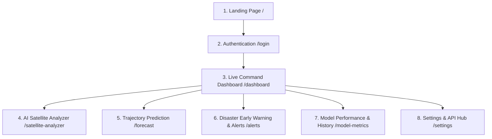

# 📑 CYCLO-AI: Complete Website Pages & Operational Features Specification

**Project Topic:**  
> *"To develop an Artificial Intelligence (AI) / Machine Learning (ML) based system for identification, classification, and prediction of different tropical cyclone patterns using multi-source satellite data."*

---

## 🗺️ System Navigation Map

---

## 📑 Detailed Page Breakdown

### 1. 🌐 Landing Page (`/`)
*Public-facing overview showcasing system capabilities, live weather status, and high-impact 3D visualization.*

* **Header / Navigation Bar:**
  * System Logo & Title (*"CYCLO-AI"*).
  * Live Warning Status Pill (*🟢 Normal / 🔴 Active Warning: Cyclone Mocha*).
  * Links (*Home, Live Dashboard, AI Analyzer, Forecasts, Alerts, Docs*).
  * **"Launch Dashboard"** CTA button & Dark/Light theme switch.
* **Hero Section:**
  * Interactive 3D WebGL Earth globe with animated cyclone vortex and orbital satellite scanning beam (See [`3D_HERO_SPECIFICATION.md`](file:///c:/Users/ASUS/OneDrive/Documents/SIH2K26/3D_HERO_SPECIFICATION.md)).
  * Primary Action buttons: **"Launch Dashboard"** and **"Analyze Satellite Feed"**.
* **Live Storm Ticker:**
  * Real-time counter of active depressions/cyclones across the North Indian Ocean / Global basins.
  * Status chips showing storm name, basin, intensity, and central pressure.
* **Core Technology Cards:**
  * Multi-Source Satellite Fusion (INSAT-3D/3DR, Oceansat, Scatterometer, GOES).
  * Deep Learning Pattern Recognition (Automated Dvorak, Eye detection).
  * Physics-Informed Trajectory & Intensity Forecasting.
  * Explainable AI (Grad-CAM) for transparent decisions.
* **Footer:** Data provider credits (IMD, ISRO/MOSDAC, NOAA, WMO), emergency helpline numbers.

---

### 2. 🔐 Authentication & Role-Based Access (`/login`, `/register`)
*Secure access control tailored for meteorologists, disaster officers, and the public.*

* **Auth Form:**
  * Email / Username input field (format validated).
  * Password input field with **Show / Hide toggle** and strength indicator.
  * **"Remember this device"** checkbox & **"Forgot Password?"** link.
  * **"Sign In"** / **"Create Account"** button.
* **Role Selection:**
  * 🧑‍🔬 *Meteorologist / Scientific Researcher* (Access to raw satellite bands & custom inference).
  * 🛡️ *Disaster Response Official (NDMA/SDMA)* (Access to alert broadcasts & evacuation tools).
  * 👤 *General Public / Student* (Read-only forecast access).
* **Agency Verification Field:**
  * Government Officer Badge / Agency ID for disaster personnel.
* **Security:**
  * Captcha verification & 2FA modal for administrative roles.

---

### 3. 🛰️ Live Cyclone Monitoring & Geospatial Dashboard (`/dashboard`)
*The primary operational command center for real-time storm tracking.*

* **Top Control Bar:**
  * **Storm Selector Dropdown:** Pick active storm or view all.
  * **Basin Filter:** *All, Bay of Bengal, Arabian Sea, Global*.
  * **Live Auto-Refresh:** 5, 15, or 30 minutes toggle.
  * **Clock:** Dual UTC & IST display.
* **Interactive Map Canvas:**
  * **Layer Switcher:**
    * Thermal Infrared (TIR-1 - Cloud top temperatures).
    * Visible (VIS - High resolution daytime imagery).
    * Water Vapor (WV - Tropospheric moisture).
    * Scatterometer ocean surface wind streamlines.
    * Sea Surface Temperature (SST) heatmap.
  * **Map Tools:** Fullscreen, Zoom, Distance measurement, Lat/Lon cursor tracker.
  * **Storm Layer:** Animated cyclone eye marker, past track line, radius of maximum winds ($R_{max}$).
* **Telemetry HUD (Sidebar):**
  * Storm Name & Category Badge (*e.g., "Very Severe Cyclonic Storm - Cat 3"*).
  * Dvorak T-Number / CI Number (*e.g., T4.5 / CI 4.5*).
  * Coordinates (Latitude, Longitude).
  * Max Sustained Wind Speed Gauge ($knots / km/h$).
  * Central Atmospheric Pressure ($hPa / mb$).
  * Forward Translation Velocity (*e.g., "NNW at 14 km/h"*).
* **Timeline Scrubber:** 24–72 hour frame playback slider with speed controls ($1x, 2x, 4x$).
* **Actions:** Export GeoJSON/KML, "Deep Analyze in AI Studio" shortcut.

---

### 4. 🧠 AI Satellite Analyzer & Pattern Studio (`/satellite-analyzer`)
*The core ML workspace where satellite imagery is ingested, classified, and explained.*

* **Ingestion Section:**
  * Drag-and-drop imagery uploader (`.png`, `.tiff`, `.nc`, `.h5`).
  * Live satellite stream picker (*INSAT-3D, INSAT-3DR, GOES-16, Himawari-9*).
  * Spectral channel selector (TIR1, TIR2, MIR, VIS, WV).
* **Image Processing Tools:**
  * Color Enhancement: *Dvorak BD-curve, Rainbow thermal, Grayscale, Inverted IR*.
  * Interactive Bounding Box / Crop Tool for Region of Interest (ROI).
* **Model Inference Controls:**
  * Model selector (*Hybrid ConvNeXt-ViT, ResNet-50 Dvorak, Deep-Cyclone Ensemble*).
  * **"Run AI Analysis"** button with real-time inference progress bar.
* **AI Output & Pattern Classification Results:**
  * **Identified Pattern Class:** *Curved Band, Eye Pattern, CDO, Shear Pattern, Embedded Center*.
  * **Confidence Score:** Percentage indicator (e.g., $96.4\%$).
  * **Eye / Center of Circulation (LLCC):** Detected coordinates with bounding box overlay.
  * **Estimated Intensity:** Calculated T-Number ($T1.0-T8.0$) and peak wind speed.
* **Explainability (XAI) Studio:**
  * **Grad-CAM / Attention Map Slider:** Blend between raw satellite image $\leftrightarrow$ AI attention heatmap.
  * **Feature Attribution Summary:** Bullet points detailing cloud structure features identified by the model.

---

### 5. 📈 Trajectory & Intensity Prediction Center (`/forecast`)
*Predicting the future path, landfall time, and intensity variation.*

* **Forecast Horizon Selector:** $+6h, +12h, +24h, +48h, +72h, +120h$.
* **Forecast Trajectory Map:**
  * Past Observed Track (Solid line).
  * AI Projected Track (Dashed line with time-stamped waypoints).
  * **Cone of Uncertainty Polygon:** Semi-transparent confidence dispersion area.
  * **Landfall Marker:** Pin with estimated landfall location and countdown timer.
* **Intensity Graphs:**
  * Wind Speed ($V_{max}$) prediction curve with upper/lower confidence bounds.
  * Central Pressure ($P_c$) drop timeline ($hPa$).
  * Rapid Intensification (RI) probability gauge.
* **NWP Comparison Matrix:** Side-by-side comparison of AI forecast vs. numerical weather models (IMD GFS, ECMWF, WRF).
* **Export:** Download trajectory as CSV, GeoJSON, or Shapefile.

---

### 6. ⚠️ Disaster Early Warning & Coastal Alert Hub (`/alerts`)
*Decision-support tools for disaster management authorities (NDMA/SDMA).*

* **IMD 4-Stage Warning Banner:**
  * 🟡 **Stage 1 (Yellow):** *Pre-Cyclone Watch (72h)*
  * 🟠 **Stage 2 (Orange):** *Cyclone Alert (48h)*
  * 🔴 **Stage 3 (Red):** *Cyclone Warning (24h)*
  * 🟣 **Stage 4 (Purple):** *Post-Landfall Outlook*
* **District-Level Impact Table:**
  * Columns: *State, District, Severity Badge, Wind Gusts ($km/h$), 24h Rainfall ($mm$), Storm Surge Height ($m$), Evacuation Priority*.
  * Search/Filter by coastal district name.
* **Inundation Simulation Map:** Saltwater flooding and sea surge reach overlay.
* **Automated Bulletin Generator:**
  * One-click official PDF bulletin generator.
  * **Multi-Language Selector:** *English, Hindi, Bengali, Odia, Tamil, Telugu, Gujarati*.
* **Emergency Broadcast Simulator (Restricted):**
  * Common Alerting Protocol (CAP) SMS preview & geo-fenced test broadcast trigger.

---

### 7. 📊 Model Performance & Historical Archive (`/model-metrics`)
*Scientific validation and historical benchmark replays.*

* **Historical Cyclone Replay:**
  * Select past benchmark storms: *Amphan (2020), Fani (2019), Biparjoy (2023), Mocha (2023)*.
  * **"Replay Simulation"** to run historical satellite sequences frame-by-frame.
* **Accuracy & Error Metrics:**
  * Track Forecast Error: Mean Distance Error ($<65\text{ km}$ at 24h, $<120\text{ km}$ at 48h).
  * Intensity Estimation Error: MAE ($<8.5\text{ knots}$) and RMSE.
* **ML Visualizations:**
  * Confusion Matrix for Dvorak pattern classes.
  * ROC-AUC and Precision-Recall interactive plots.
  * Training vs. Validation loss convergence curves.
* **Dataset Stats:** Total training frames ($150,000+$), sensor breakdown, train/val/test splits.

---

### 8. ⚙️ System Settings & Data Connectors (`/settings`)
*Administrative settings, satellite API connections, and external integrations.*

* **Satellite Feed Connectors:**
  * ISRO / MOSDAC Open Data API URL and key configuration.
  * NOAA Open Data S3 bucket credentials & sync frequency (15m/30m/1h).
  * Real-time latency and health indicators.
* **AI Model Engine Management:**
  * Active checkpoint selector (e.g., `v2.4-convnext-vit-ensemble`).
  * Hardware monitor (GPU/VRAM usage, inference latency in $ms$).
* **Notification Webhooks:**
  * Webhook setup for State Disaster Management portals.
  * Email/SMS gateway credentials.
* **Developer API Hub:**
  * REST API token manager and interactive Swagger/OpenAPI documentation (`GET /api/v1/cyclone/active`, `POST /api/v1/predict/trajectory`).

---
*Maintained as the official website architecture specification for CYCLO-AI (SIH 2026).*
