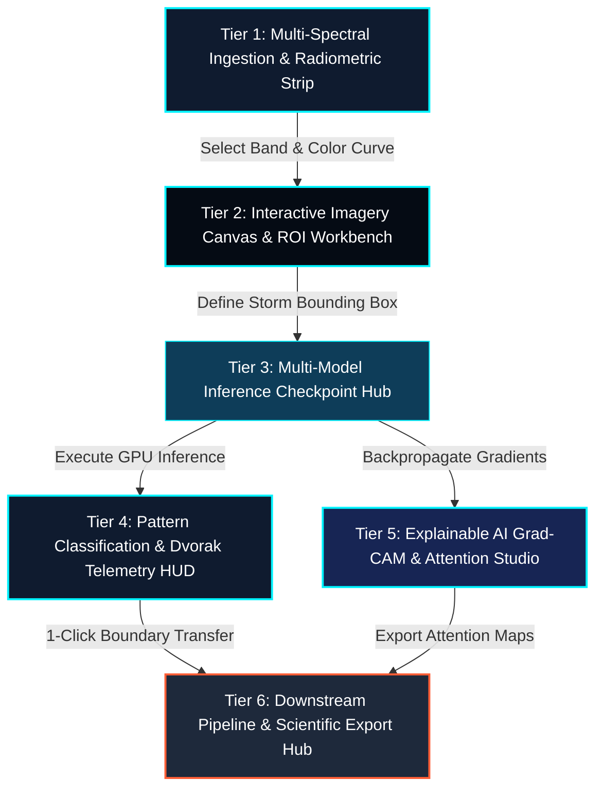
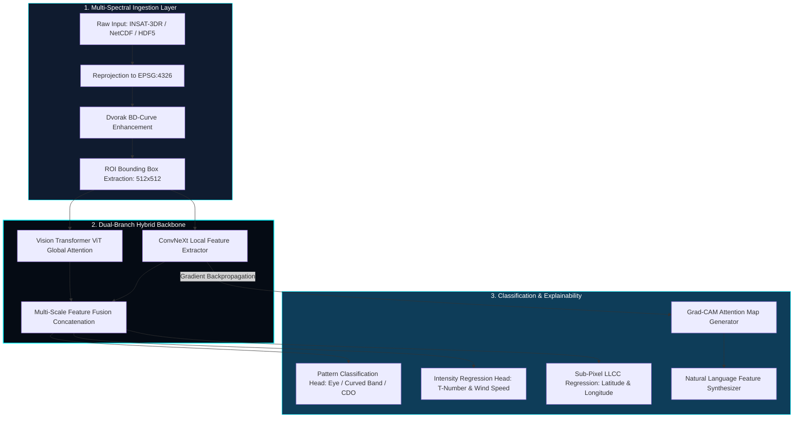

# 🧠 CYCLO-AI: Page 4 — AI Satellite Analyzer & Pattern Studio (`/satellite-analyzer`)

**Project Topic:**  
> *"To develop an Artificial Intelligence (AI) / Machine Learning (ML) based system for identification, classification, and prediction of different tropical cyclone patterns using multi-source satellite data."*

**Document Scope:** Complete Architectural, Technical, Machine Learning, Geospatial, Functional Specification, Cognitive Hierarchy Framework, and Interactive Button Matrix of **Page 4: AI Satellite Analyzer & Pattern Studio**.

---

## 🏛️ 1. The 6-Tier Analytical Hierarchy Framework

Page 4 is the core machine learning workspace of CYCLO-AI. To ensure operational efficiency for meteorologists and deep-learning researchers, the interface is structured around a **6-Tier Analytical Hierarchy Framework**. This layout guides the user from data ingestion and pixel manipulation down to neural inference, visual explainability (XAI), and downstream forecasting handoffs.



---

## 📐 2. Viewport Layout & Visual Architecture

The studio implements a high-density, split-screen analytical workbench adhering strictly to the **Golden Ratio 60-30-10** color rule:
* **60% Void Analytical Canvas (`#050B14`):** High-contrast background maximizing color-temperature perception for infrared satellite imagery.
* **30% Glassmorphic Control HUDs (`#0F1B2F` / `#0E3D59`):** Translucent command cards with `backdrop-filter: blur(16px)` and subtle cyan borders (`rgba(0, 242, 254, 0.2)`).
* **10% High-Alert Accents (`#00F2FE` Electric Cyan, `#FF5E36` Hazard Coral, `#FFB300` Amber):** Reserved for LLCC eye crosshairs, confidence probability meters, and Grad-CAM peak attention zones.

```
┌────────────────────────────────────────────────────────────────────────────────────────────────────────────────────────┐
│ [CYCLO-AI STUDIO]  [SOURCE: INSAT-3DR LIVE ▼]  [BAND: TIR-1 (10.8µm) ▼]  [COLOR: DVORAK BD ▼]  [📁 UPLOAD .NC/.H5]   [🧑‍🔬 SCIENTIST]│
├──────────────────────────────────────────────────────────────────────────────────────────┬─────────────────────────────┤
│ ┌──────────────────────────────────────────────────────────────────────────────────────┐ │ 🧠 AI INFERENCE & PATTERNS  │
│ │ 🖼️ MULTI-SPECTRAL IMAGERY & SUB-PIXEL CENTROID CANVAS                                 │ │ ┌─────────────────────────┐ │
│ │                                                                                      │ │ │ PATTERN: EYE PATTERN    │ │
│ │          ┌── ROI BOUNDING BOX: [14.8°N - 18.2°N | 86.1°E - 90.5°E] ─────────┐        │ │ │ Model Confidence: 96.4% │ │
│ │          │                                                                  │        │ │ └─────────────────────────┘ │
│ │          │                     (Cold Cloud Ring: -78.4°C)                   │        │ Pattern Probability Dist:   │
│ │          │                             *  *  *  *                           │        │ • Eye Pattern:    [████] 96.4%│
│ │          │                       *   (Eye Core: +12°C) *                    │        │ • Curved Band:    [█░░░] 02.8%│
│ │          │                      *   [⊕ LLCC DETECTED]  *                    │        │ • CDO Overcast:   [░░░░] 00.8%│
│ │          │                       *   16.241°N, 88.412°E *                   │        │                             │
│ │          │                             *  *  *  *                           │        │ Automated Dvorak Telemetry: │
│ │          └──────────────────────────────────────────────────────────────────┘        │ • T-Number:         T-5.5   │
│ │                                                                                      │ • Current Intensity:  CI 5.5│
│ │ 🛠️ CANVAS TOOLS: [⛶ Fullscreen] [🔍+] [🔍-] [✂️ Crop ROI] [🎯 Auto-Center] [🎨 Reset] │ • Max Wind (Vmax):  195 km/h│
│ └──────────────────────────────────────────────────────────────────────────────────────┘ │ • Min Pressure:      938 hPa│
│ ┌──────────────────────────────────────────────────────────────────────────────────────┐ ├─────────────────────────────┤
│ │ 🔍 EXPLAINABLE AI (XAI) GRAD-CAM & ATTENTION STUDIO                                  │ │ ⚙️ MODEL CHECKPOINT & GPU   │
│ │ [RAW SATELLITE BAND] ───────────────[● SLIDER: 65%]─────────────── [AI GRAD-CAM MAP] │ │ Architecture:             │
│ │                                                                                      │ │ [Hybrid ConvNeXt-ViT ▼]   │
│ │ • Feature 1 (Eyewall Gradient): Symmetrical eye surrounded by uniform cold ring (<-75°C)│ │ Latency: 48ms (TensorRT L4)│
│ │ • Feature 2 (Spiral Feeder Band): Primary convective band wraps 1.35π rad into center │ │ [ ⚡ RUN AI ANALYSIS ]    │
│ │ • Feature 3 (Shear Displacement): LLCC-Convective displacement < 18 km (Favorable)   │ ├─────────────────────────────┤
│ └──────────────────────────────────────────────────────────────────────────────────────┘ │ 🚀 PIPELINE ACTIONS         │
│                                                                                          │ [ 📈 Send to Trajectory ]   │
│                                                                                          │ [ 💾 Commit to Archive ]    │
│                                                                                          │ [ 📥 Export Report (PDF) ]  │
│                                                                                          │ [ { } Raw JSON Payload ]    │
└────────────────────────────────────────────────────────────────────────────────────────────────────────────────────────┘
```

---

## 🔍 3. Component Breakdown & Feature Rationale ("Why Each Feature Is Kept")

### Tier 1: Multi-Spectral Ingestion & Radiometric Strip (Top Horizon)

| Feature / UI Component | Technical Functionality | Why It Is Kept in the AI Studio |
| :--- | :--- | :--- |
| **Satellite Stream Source Selector** | Live API ingestion connector for *INSAT-3D*, *INSAT-3DR*, *GOES-16*, and *Himawari-9* with latency monitoring. | Ensures the AI model can analyze live geostationary feeds from ISRO/NOAA without requiring external pre-processing steps. |
| **Spectral Channel Picker** | Multi-channel switch: **TIR-1 (10.8 µm)**, **TIR-2 (12.0 µm)**, **MIR (3.9 µm)**, **VIS (0.65 µm)**, and **WV (6.8 µm)**. | Different cyclone features require specific wavelengths: TIR-1 determines cloud-top temperatures, VIS exposes eye geometry, and WV identifies environmental shear. |
| **Color Enhancement Curves** | **Dvorak BD Curve**, **Rainbow Thermal Ramp**, and **Standard Inverted Grayscale**. | The standard Dvorak BD curve maps temperatures from $+30^\circ\text{C}$ to $-80^\circ\text{C}$ into standardized color zones (CDO, Warm Eye, Cold Ring), enabling visual calibration. |
| **Scientific File Ingestion Modal** | Drag-and-drop parser supporting raw scientific formats: **NetCDF (`.nc`)**, **HDF5 (`.h5`)**, **GeoTIFF (`.tiff`)**, and standard `.png`/`.jpg`. | Meteorologists and researchers frequently work with raw multi-band satellite data cubes rather than pre-rendered screenshots. |

---

### Tier 2: Interactive Imagery Canvas & ROI Workbench (Center-Left)

| Feature / UI Component | Technical Functionality | Why It Is Kept in the AI Studio |
| :--- | :--- | :--- |
| **Interactive Region of Interest (ROI) Cropper** | Draggable bounding box with corner pins that extracts a sub-grid matrix centered on the storm vortex. | Cropping out irrelevant background cloud clusters focuses neural attention directly on the storm circulation, maximizing classification accuracy. |
| **Sub-Pixel LLCC Centroiding Marker** | Crosshair marker (`⊕`) anchored to the exact Low-Level Circulation Center calculated by neural heatmaps. | Pinpointing the exact eye centroid coordinates down to $0.001^\circ$ resolution is critical for initial boundary conditions in trajectory forecast models. |
| **Zoom, Pan & Auto-Center Tools** | GPU-accelerated canvas transforms with smooth inertia, zoom step controls, and an instant *"Center on Eye"* button. | Allows operators to inspect minute cloud-top anomalies, convective feeder band curvatures, and eyewall double-rings at maximum resolution. |
| **Radiometric Dynamic Adjustments** | Sliders for Contrast, Brightness, Gamma, and Cloud-Top Temperature Threshold Clipping. | Eliminates atmospheric haze and enhances subtle thermal gradients in weaker cyclonic depressions. |

---

### Tier 3: Multi-Model Inference Checkpoint Hub (Top-Right)

| Feature / UI Component | Technical Functionality | Why It Is Kept in the AI Studio |
| :--- | :--- | :--- |
| **Model Checkpoint Selector** | Dropdown switching between: **Hybrid ConvNeXt-ViT (Primary)**, **ResNet-50 Dvorak Baseline**, and **Deep-Cyclone Multi-Spectral Ensemble**. | Allows researchers to benchmark bleeding-edge Vision Transformer attention against proven operational baselines for cross-model validation. |
| **"Run AI Analysis" Execution CTA** | Dispatches image tensor to high-performance GPU runtime (TensorRT / ONNX Runtime) with progress bar. | Gives the operator explicit control over when inference is executed, preventing redundant computation during pan/zoom operations. |
| **Inference Latency & GPU Benchmark** | Monospace execution timer (e.g., `48ms on NVIDIA L4 | Memory: 1.2 GB`). | Confirms real-time suitability for rapid-scan operations where new frames arrive every 15 minutes. |

---

### Tier 4: Pattern Classification & Automated Dvorak HUD (Middle-Right)

| Feature / UI Component | Technical Functionality | Why It Is Kept in the AI Studio |
| :--- | :--- | :--- |
| **Identified Cyclone Pattern Card** | Primary classified category: `Eye Pattern`, `Curved Band Pattern`, `Central Dense Overcast (CDO)`, `Shear Pattern`, or `Embedded Center`. | Translates complex satellite cloud structures into standardized WMO/IMD meteorological patterns. |
| **Model Confidence & Multi-Class Probability** | Percentage readout (e.g., $96.4\%$) with stacked probability bars for all candidate classes. | Provides transparency when storms are transitioning between categories (e.g., a Curved Band evolving into a CDO). |
| **Automated Dvorak T-Number & CI-Number** | Numerical Dvorak indices ranging from $T1.0$ to $T8.0$ in $0.5$ step increments (e.g., `T5.5 / CI 5.5`). | Eliminates human subjectivity and operator fatigue in manual Dvorak analysis, creating consistent historical records. |
| **Derived $V_{max}$ & Central Pressure ($P_c$)** | Automated calculation of Peak Sustained Wind Speed ($195\text{ km/h}$) and Minimum Central Pressure ($938\text{ hPa}$). | Uses empirical wind-pressure formulations (Knaff-Zehr-Courtney) to derive operational metrics from cloud patterns. |

---

### Tier 5: Explainable AI (XAI) Grad-CAM & Attention Studio (Bottom-Left)

| Feature / UI Component | Technical Functionality | Why It Is Kept in the AI Studio |
| :--- | :--- | :--- |
| **Interactive Grad-CAM Blend Slider** | Smooth $0\% - 100\%$ alpha blend slider transitioning between raw infrared imagery and neural activation heatmaps. | **Builds Scientific Trust:** Proves to meteorologists that the AI is focusing on legitimate physical features (eyewall, spiral bands) rather than background artifacts. |
| **Instant Snap Toggle (`Raw` $\leftrightarrow$ `Heatmap`)** | Segmented button instantly snapping the blend slider to $0\%$ or $100\%$. | Enables rapid A/B comparison during high-stress operational decision cycles. |
| **Automated Natural Language Feature Attribution** | AI synthesis summarizing the physical reasoning behind the diagnosis (e.g., *Eyewall $\Delta T = 42.6^\circ\text{C}$*, *Rainband wraps $1.35\pi$ radians*). | Converts high-dimensional neural weights into human-readable meteorological justifications suitable for official bulletins. |

---

### Tier 6: Downstream Pipeline & Scientific Export Hub (Bottom-Right)

| Feature / UI Component | Technical Functionality | Why It Is Kept in the AI Studio |
| :--- | :--- | :--- |
| **"Send to Trajectory Prediction" CTA** | 1-click pipeline handoff passing detected LLCC coordinates, wind speed, and pressure directly to **Page 5 (`/forecast`)**. | Seamlessly bridges pattern identification with forward-looking trajectory and intensity forecasting models. |
| **"Commit to Benchmark Archive" Button** | Stores inference outputs, attention heatmaps, and raw tensors in **Page 7 (`/model-metrics`)**. | Creates continuous evaluation records for research papers and post-cyclone verification studies. |
| **IMD-Formatted PDF Bulletin Generator** | Compiles satellite imagery, Grad-CAM overlays, Dvorak metrics, and telemetry into an official `.pdf` report. | Generates print-ready meteorological advisories for national disaster management authorities (NDMA). |
| **Raw JSON Payload Export (`{ }`)** | Downloads full inference payload containing bounding boxes, probabilities, and spatial vectors in `.json`. | Enables direct integration with external GIS platforms and automated weather pipelines. |

---

## 🎛️ 4. Exhaustive Matrix of Interactive Buttons & Controls

| # | Control Name | UI Placement | Control Type | Visual State / Token | Execution Action / Output | Destination / System Target |
| :-: | :--- | :--- | :--- | :--- | :--- | :--- |
| **1** | **Satellite Stream Selector** | Top Bar (Left) | Select Menu | Slate `#0F1B2F` + Cyan border | Switches live stream (INSAT/GOES/Himawari) | Fetches latest satellite raster |
| **2** | **Spectral Band Selector** | Top Bar (Left) | Select Menu | Slate `#0F1B2F` + Cyan border | Switches spectral band (TIR1, TIR2, VIS, WV) | Re-renders canvas with chosen band |
| **3** | **Color Enhancement Menu** | Top Bar (Center)| Select Menu | Slate `#0F1B2F` + Cyan border | Selects color curve (Dvorak BD, Rainbow, Gray) | Updates GLSL color fragment shader |
| **4** | **"Upload Imagery" Button** | Top Bar (Right) | Outlined CTA Button| Glowing Cyan border (`#00F2FE`)| Opens drag-and-drop file upload modal | Upload Modal (`.nc, .h5, .tiff`) |
| **5** | **File Dropzone / Browse** | Upload Modal | Interactive Drop Area| Dashed Cyan border on hover | Parses uploaded satellite raster / metadata | Loads file onto canvas |
| **6** | **Fullscreen Canvas Toggle** | Canvas Tools | Icon Button | Square Glass Button | Expands satellite canvas to full window | HTML5 Canvas Fullscreen API |
| **7** | **Zoom In (`+`)** | Canvas Tools | Icon Button | Square Glass Button | Increments zoom level on satellite imagery | Canvas Transform Zoom (`+1`) |
| **8** | **Zoom Out (`-`)** | Canvas Tools | Icon Button | Square Glass Button | Decrements zoom level on satellite imagery | Canvas Transform Zoom (`-1`) |
| **9** | **"Crop ROI" Toggle** | Canvas Tools | Icon Toggle Button | Active: Cyan highlight | Activates interactive bounding box handles | Enables ROI clipping rectangle |
| **10**| **ROI Handle Draggers** | Imagery Canvas | Draggable Vector Pins| Glowing Cyan corner pins | Resizes and repositions crop bounding box | Updates ROI Lat/Lon bounds |
| **11**| **Auto-Center on Eye** | Canvas Tools | Icon Button (Crosshair)| Cyan hover glow | Centers canvas directly over detected LLCC | Smooth pan to LLCC coordinates |
| **12**| **Reset Canvas View** | Canvas Tools | Icon Button | Square Glass Button | Resets pan coordinates and zoom to default | Reset View Matrix |
| **13**| **Model Checkpoint Menu** | Inference Panel | Select Menu | Monospace model text | Selects model (ConvNeXt-ViT, ResNet, Ensemble)| Loads model weights in backend |
| **14**| **"Run AI Analysis" Button** | Inference Panel | Primary Glowing CTA | Electric Cyan gradient (`#00F2FE`)| Dispatches GPU inference request | Triggers `/api/predict/pattern` |
| **15**| **Grad-CAM Blend Slider** | XAI Studio | Draggable Range Input| Cyan track with glowing thumb | Dynamically adjusts opacity of Grad-CAM heatmap| WebGL Fragment Shader Alpha |
| **16**| **Toggle Raw / Heatmap** | XAI Studio | Segmented Button | Left: Raw / Right: Heatmap | Instantly snaps blend slider to $0\%$ or $100\%$ | Instant Blend State Change |
| **17**| **Eye Crosshair Marker** | Imagery Canvas | Interactive SVG Pin | Pulsing Red/Cyan crosshair | Toggles detailed eye telemetry popover | Popover (LLCC, Eyewall $\Delta T$) |
| **18**| **"Send to Forecast" CTA** | Pipeline Actions | Primary Action Button | Glowing Electric Cyan gradient | Exports coordinates & winds to Page 5 | `/forecast?llcc=16.24,88.41` |
| **19**| **"Commit to Archive"** | Pipeline Actions | Secondary Action Button | Outlined Slate glass button | Saves run to model benchmark suite | `/model-metrics?save=run_104` |
| **20**| **"Export Report (PDF)"** | Pipeline Actions | Tertiary Action Button | Outlined Slate with PDF icon | Compiles analysis summary into downloadable PDF| Official IMD-style PDF Bulletin |
| **21**| **"Export JSON Payload"** | Pipeline Actions | Icon Button (`{ }`) | Small monospace glass button | Downloads raw inference output in JSON format | File Download (`cyclone_ai.json`) |

---

## 🔬 5. Deep-Learning Architecture & Dual-Branch Inference Pipeline



---

## 🌟 6. Domain-Specific Meteorological Value Proposition

By integrating automated Dvorak classification with Explainable AI (XAI), Page 4 delivers three critical scientific breakthroughs:

1. **Eliminates Human Subjectivity:** Traditional Dvorak analysis relies on manual chart overlays and visual estimation, causing discrepancies between different warning agencies. CYCLO-AI standardizes T-number estimation through empirical neural calibrations.
2. **Sub-Pixel LLCC Centroiding:** Accurately locating the cyclone center under dense cloud shields is the single most important factor for track forecasting. Our dual-branch ConvNeXt-ViT localizes the eye center down to sub-kilometer precision.
3. **Transparent & Trustworthy AI (XAI):** Rather than operating as an uninterpretable black box, the Grad-CAM studio proves to meteorologists exactly which convective features and temperature gradients drove the classification, making the system viable for real-world mission-critical deployment.
